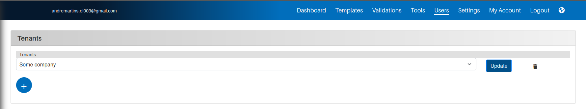

# Setting up the system

In this part, you will learn how to set up the system as well as how to define each user(s) for each one of the tenants as we call it.

## Adding all sub-organizations in the system

The first step of this process is to add all of your sub-organizations into the system. To do so, you will need to go to the main `Users` page and navigate to the `Tenants` tile.

{width=1000}

Now that you are on the right location, you will need to add all of your Tenants. To do so, you will need to trigger the system by clicking on the `plus` icon on the bottom of the tenants window.

You will then need to add all the respective suborganization coordinates and save them by clicking on the `Submit` button.

### Editing an existing Tenant

You always have the possibility to change any of the Tenants in your system by clicking on the `Update` button that is situated next to the Tenant that is currently selected.

## Adding all users for each organization

Once all tenants have been defined, you will now be able to define all of the users for each one of the organizations.

!!! warning "**Some precautions before you start adding users**"
    - Each user shall have a unique e-mail address across all tenants.

## Defining all permissions for all users as well as other preferences

**This part is still under development**