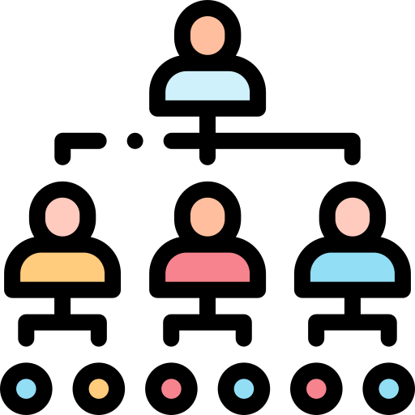

*Version: {{ page.meta.version }}*

  <a class="md-button print-button" href="../../pdfs/de/Multi tenant system.pdf" target="_blank">
    Diesen Abschnitt als PDF herunterladen
  </a>

# Konfiguration des Systems für Multi-Organisations-Unterstützung

In diesem Abschnitt des Handbuchs wird erklärt, wie Sie Ihr System so konfigurieren, dass mehrere Unterorganisationen innerhalb desselben Systems existieren.

Diese Funktionalität ermöglicht es Ihrem System, dass Unterorganisationen auf demselben System/Server arbeiten. So kann Ihr multi-organisationales Unternehmen alle innerhalb derselben Lizenz und desselben Servers arbeiten, was sowohl Kosten als auch Energieverbrauch unseres Systems verbessert.

!!! warning "**Wichtig**"
    Es ist wichtig zu verstehen, dass alle Unterorganisationen unabhängig voneinander arbeiten und dass keine Informationen oder Benutzer zwischen den Plattformen geteilt werden.

{width=350 align=center}
