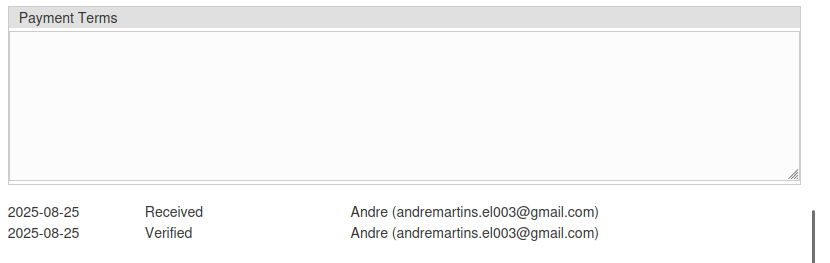
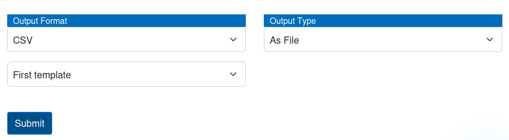

*Version: {{ page.meta.version }}*

  <a class="md-button print-button" href="../pdfs/Peppol-Documentation_with_Peppol.pdf" target="_blank">
    Diese Sektion als PDF herunterladen
  </a>

# Dokumentation mit Peppol

In diesem Abschnitt finden Sie eine Anleitung, wie Sie Ihre Dokumentation Peppol-konform gestalten und wie alle Validierungen sichtbar werden, sobald Ihre Dokumentation Peppol-konform ist.

## Erstellen von Peppol-konformen Vorlagen

Bevor Sie Peppol-konforme Validierungen haben können, müssen Sie Vorlagen erstellen, die ebenfalls Peppol-konform sind. Dadurch kann unser System automatisch alle Informationen aus jedem Element jedes Dokuments extrahieren.

Sie beginnen wie gewohnt mit dem Erstellen einer neuen Vorlage; eine detailliertere Anleitung finden Sie im [vorherigen Kapitel](../System%20Overview/Template.md#adding-a-new-template) über das Erstellen einer neuen Vorlage.

Nachdem Sie diese neue Vorlage erstellt und wie gewohnt alle Felder hinzugefügt haben, müssen Sie das System für Peppol-Konformität aktivieren. Dazu klicken Sie auf das entsprechende Kontrollkästchen unten im Fenster der Felder, und alle Peppol-spezifischen Felder erscheinen.

{width="1000"}

Sobald das System aktiviert ist, müssen Sie alle Peppol-spezifischen Felder definieren. Der Mechanismus zur Definition jedes Feldes ist derselbe wie zuvor, aber in diesem Teil definieren Sie alle Felder jedes Elements für die **Aufschlüsselung**.  
Einige wichtige Punkte, die beim Verknüpfen aller Felder zu beachten sind:

-   Alle Beispielwerte, auf die sich die Referenzen beziehen, sollen sich auf das erste Element des Dokuments beziehen.
-   Für die Beschreibung müssen Sie nur auf das erste Element der Beschreibung klicken.

Sobald Sie alle verschiedenen Felder verknüpft haben, klicken Sie nur noch auf die Schaltfläche `Absenden` am unteren Rand der Seite.

Ab jetzt sind alle Dokumente, die diese Vorlage verwenden, automatisch Peppol-konform.

## Peppol-konforme Validierungen

Sobald Sie Peppol-konforme Validierungen empfangen, werden Sie den Hauptvorteil der Verwendung von Peppol-konformen Daten in unserem System erkennen.

#### Aufschlüsselung der Elemente innerhalb jeder Validierung

Der erste Hauptunterschied, den Sie sehen werden, ist die Aufschlüsselung, die in jeder Validierung als Tabelle angezeigt wird. Dies ist auf der Validierungsbearbeitungsseite am unteren Rand der Datenseite sichtbar.

{width="600"}

#### Tabelle der (Vor)zahlungen/geleisteten Zahlungen

Das zweite zusätzliche Element bei der Verwendung von Peppol-Validierungen ist die Möglichkeit, alle (Vor)zahlungen für eine bestimmte Validierung zu speichern.

{width=850}

Um eine neue Zahlung hinzuzufügen, fügen Sie einfach eine neue Zeile in die Tabelle ein und speichern die Werte unten auf der Validierungsseite.

!!! warning "Wichtig"
    Bitte beachten Sie, dass alle verschiedenen Zahlungswerte in Bezug auf das Dokument eingegeben werden müssen. Das bedeutet, wenn ein Dokument bereits teilweise bezahlt wurde, ist der eingegebene Betrag **negativ**.

#### Tabelle der Zahlungsbedingungen

Das dritte zusätzliche Element ist das Feld `Zahlungsbedingungen`. In dieser Tabelle geben Sie alle spezifischen Zahlungsbedingungen ein, die der jeweilige Kunde angefordert hat.

{width=750}

#### Exportieren aller Elemente

Zusätzlich können Sie auch alle verschiedenen Elemente in eine Datei exportieren. Sie haben die Möglichkeit, das Exportformat sowie die Vorlage auszuwählen.

!!! info
    Bitte stellen Sie sicher, dass Sie eine Vorlage haben, die Ihren Anforderungen entspricht, bevor Sie eine Validierung exportieren.

Um diese Operation durchzuführen, müssen Sie zur Bearbeitungsseite der Validierung gehen, die Sie exportieren möchten, und bis zum Ende der Datenseite navigieren.

Dort sehen Sie alle Auswahlfelder, in denen Sie das Exportformat sowie die Vorlage auswählen können, die Sie verwenden möchten.  
Nachdem Sie Ihre Präferenzen ausgewählt haben, klicken Sie einfach auf die Schaltfläche `Exportieren` unten auf der Seite, und die Datei wird automatisch auf Ihr System heruntergeladen.

{width="600"}
