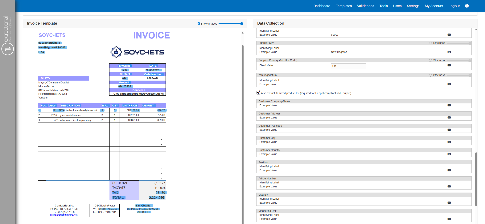
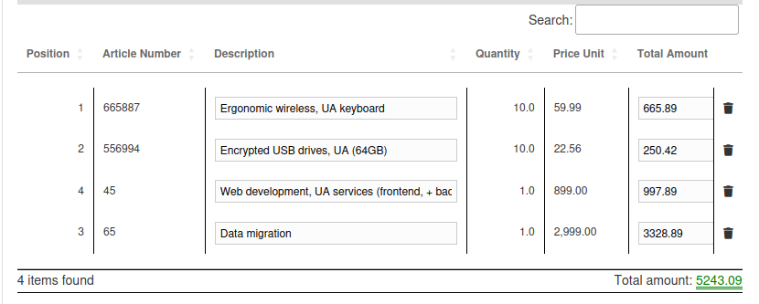
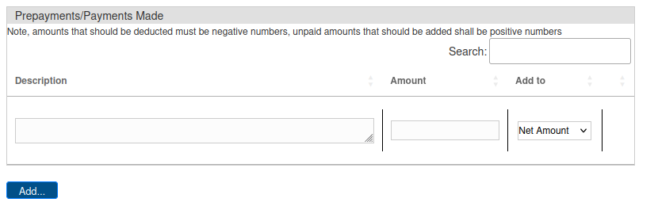

*Version : {{ page.meta.version }}*

  <a class="md-button print-button" href="../../pdfs/fr/Peppol-Documentation_with_Peppol.pdf" target="_blank">
    Obtenir cette section en PDF
  </a>

# Documentation avec Peppol

Dans cette section, vous trouverez un guide expliquant comment rendre votre documentation conforme à Peppol ainsi qu’un guide montrant comment toutes les validations doivent être visibles une fois que votre documentation est conforme à Peppol.

## Création de modèles conformes à Peppol

Avant de commencer à avoir des validations conformes à Peppol, vous devrez créer des modèles qui soient également conformes à Peppol. Cela permettra à notre système d’extraire automatiquement toutes les informations de chaque élément de chaque document.

Vous commencerez par créer un nouveau modèle comme d’habitude ; un guide plus détaillé se trouve dans le [chapitre précédent](../System%20Overview/Template.md#adding-a-new-template) concernant la création d’un nouveau modèle.

Une fois que vous avez créé ce nouveau modèle et ajouté tous les champs comme d’habitude, vous devrez activer le mode conforme à Peppol. Pour ce faire, cliquez sur la case à cocher correspondante située en bas de la fenêtre des champs, et tous les champs spécifiques à Peppol apparaîtront.

{width="1000"}

Une fois le système activé, vous devrez définir tous les champs spécifiques à Peppol. Le mécanisme pour définir chaque champ reste le même, mais cette fois vous définirez tous les champs de chaque élément pour l’**individualisation**.  
Quelques points importants à considérer lors du lien de tous les champs :

-   Toutes les valeurs d’exemple auxquelles les références doivent se rapporter doivent se référer au premier élément du document.
-   Pour la description en particulier, il suffit de cliquer sur le premier élément de la description.

Une fois que vous avez relié tous les champs différents, il ne vous reste plus qu’à cliquer sur le bouton `Soumettre` situé en bas de la page.

Désormais, tous les documents utilisant ce modèle seront automatiquement conformes à Peppol.

## Validations conformes à Peppol

Une fois que vous commencerez à recevoir des validations conformes à Peppol, vous verrez le principal avantage d’utiliser des données conformes à Peppol dans notre système.

#### Individualisation des éléments dans chaque validation

La première différence principale que vous pourrez constater est l’individualisation visible sous forme de tableau dans chaque validation. Cela peut être vu dans la page d’édition de validation, en bas de la page des données.

{width="600"}

#### Tableau des prépaiements/paiements effectués

Le deuxième élément supplémentaire disponible lors de l’utilisation de validations conformes à Peppol est la possibilité de stocker tous les (pré)paiements effectués pour une validation spécifique.

{width=850}

Pour ajouter un nouveau paiement, il suffit d’ajouter une nouvelle ligne dans le tableau et d’enregistrer les valeurs en bas de la page de validation.

!!! warning "Important"
    Veuillez noter que toutes les différentes valeurs de paiement doivent être saisies en relation avec le document, ce qui signifie que si un document a déjà été partiellement payé, le montant saisi sera **négatif**.

#### Tableau d’indication des conditions de paiement

Le troisième élément supplémentaire est le champ `Conditions de paiement`. Dans ce tableau, vous devez saisir toutes les conditions de paiement spécifiques demandées par le client concerné.

{width=750}

#### Exportation de tous les éléments

De plus, vous pouvez également exporter tous les différents éléments dans un fichier. Vous aurez la possibilité de choisir le format d’exportation ainsi que le modèle.

!!! info
    Veuillez vous assurer que vous disposez d’un modèle adapté avant d’exporter une validation.

Pour réaliser cette opération, vous devez vous rendre sur la page d’édition de la validation que vous souhaitez exporter et naviguer jusqu’à la fin de la page de données.

Une fois là, vous verrez tous les champs sélectifs où vous pouvez choisir le format d’exportation ainsi que le modèle que vous souhaitez utiliser.  
Après avoir sélectionné vos préférences, il vous suffit de cliquer sur le bouton `Exporter` en bas de la page, et le fichier sera automatiquement téléchargé sur votre système.

{width="600"}
