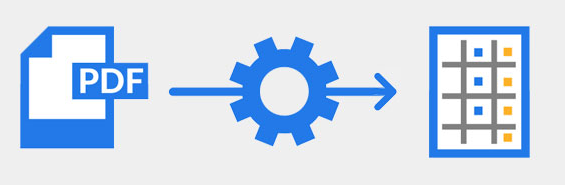
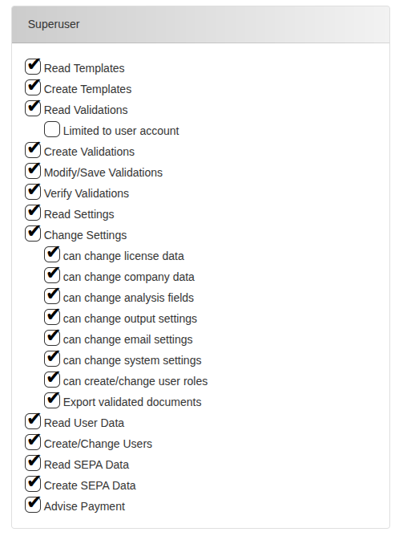

This chapter provides an overview of the system and outlines its main
components and functionalities. It explains how responsibilities are
distributed among different user roles, highlights key safety and access
considerations, and describes the various views available within the
user interface. Understanding these fundamentals will help users
navigate and interact with the system effectively.

??? info
    -   `Document:` in our system, when we talk about documents, we are
        talking about **Invoices, Credit notes, Delivery notes, Order forms,
        Order confirmations**, in other words, we talk about all financial
        documents that are generally interchanged in companies.

    -   `Validation:` entity in our system that represents one incoming out
        outgoing document that as been registered in our system.

    -   `Templates:` A template, in our system, is all the entities that are
        used as a reference to extract data from further incoming/outgoing
        documents.

    -   `"Envelope Data":` All fields that form the header and footer of the
        document (general information of the document).

    -   `"Line items":` Document's positioned items, in other words, all
        data that will be used for Peppol data extraction.

## Purpose and functionality

Welcome to the Extractional User Manual. In this guide, you'll find
comprehensive information about how to use our software system
effectively. Before diving in, we'll provide a brief overview of its
purpose and explain how it can help your company streamline operations
and save valuable time.

### Extracting and automating purchasing documents data

The main goal of our system is to extract data from all incoming and
outgoing purchasing and billing documents within a company. Once
extracted, the data will be processed, allowing one to automate
processes and also automatically export it into other systems,
streamlining operations and reducing manual workload.

#### PDF files extraction

Our software will extract data from all pdf formatted files. This allows
our users to not need to change all their billing habits and maintains
the usage of one of the most used format for these type of documents.

{ width="300"}
/// caption

///

#### Direct email account connection

<!-- {width="50" align=left} -->
{width="50" align=left}

This software will automatically insert all incoming billing documents
in the system by directly connecting to a e-mail address. This is done
via a IMAP connection, witch is available for most of email domains.

### Usage of numerical data

One main advantage of using our system is the complete usage of
numerical data. This will easy your company easy of organisation and
improve some daily tasks of your employees.

#### Ease of document control 

One of the primary objectives we achieved with our software was to make
it easy to organize all incoming and outgoing documents without
consuming unnecessary employee time.

As you may know, the volume of documents most companies receive and
handle can be overwhelming. Tracking the status of each document, along
with the associated transactions, can be challenging to manage
effectively.

Our system makes document organization straightforward while also
keeping track of their status. It allows automatic assignment of
documents to team members and uses flags or markers to indicate their
state. Additionally, it organizes all transactions associated with each
document.

{width="600"}
/// caption
*Example of an existing file in our system with two flags assigned to it*
///

#### Improving file searching

<!-- {width="50" align=left} -->
{width="50" align=left}

Since our system relies on a numerical file storage system and features
quick file searching algorithms and filtering algorithm , it will
improve your company's productivity by not needing to look for a
specific document like the old days.

#### Reducing paper usage in your company

<!-- {width="50" align=left} -->
{width="50" align=left}

Automating document handling with our system significantly reduces paper
usage. Since there is no longer a need to print documents for
organizational purposes, as is common in many companies, this system
allows your business to operate in an almost paperless environment.

## User Management

One of the key features of our system is the ability to define different
user roles and automate work distribution.

### User Roles

Our system provides several predefined user roles and also allows you to
create new ones. Each role comes with specific permissions, which in
turn determine the user's view and capabilities within the system.\

#### Permissions

Permissions in the system mainly control the type of access each team
member has to your document database, as well as what they can create,
modify, or delete in the system.

{width="500"}
/// caption
*Picture showing all the different permissions available in our system*
///

Each permission has been defined to endure that all important operations
in the system can be controlled. These are the following permissions
available in the system:

-   `Read templates:` The user is allowed to access all templates and
    view them.

-   `Create templates:` The user is allowed to create new templates as
    well as deleting/modifying existing ones

-   `Read Validations:` The user is allowed to read all validations
    (documents) that are available in the system

    -   `Limited to user account:` This option can be chosen if you only
        want the user to be able to see all the validations that are
        assigned to his name.

-   `Create validations:` The user is allowed to create new validation
    instances in the system. However, these permissions do not allow us
    to make these new validations as accepted in the system, they will
    basically be always seen as unverified documents.

-   `Modify/Save Validations:` The user has the rights to modify all the
    data extracted in a document and to save it on the system.

-   `Verify Validations:` The user has the rights to verify the
    documents and release them into the system.

-   `Read Settings:` The user is allowed to enter the settings page and
    see all the different preferences chosen. He will not be able to
    change any data.

-   `Change Settings:` The user has the permission to change some(all)
    settings. All the different settings sub-pages that this user shall
    be able to use must be specifically defined in the indented boxes.

-   `Read User Data:` The user is allowed to read all the system user
    data.

-   `Create/Change Users:` The user is allowed to create a new user or
    modify existing ones.

-   `Read SEPA Data:` The user is allowed to read all SEPA related data
    (for example bank credentials of documents payments)

-   `Create SEPA Data:` The user is allowed to create SEPA related data,
    this allowing the automation of payment of documents.

-   `Advise Payment:` The user is also allowed to identify documents as
    \"Paid\" in the system.

#### Why We Use User Roles

The decision to implement user roles is straightforward: having
predefined user types makes it easy to define new categories of users
with a specific set of rights.\
Additionally, if a particular category of user needs different
permissions, you only need to update the settings for that role rather
than changing permissions individually for each user.

### Simplified people management

Our software enables you to monitor your team's workload, ensuring that
tasks are distributed evenly. This helps you identify and address
workload imbalances early, ensuring that your team works collaboratively
and efficiently.

## Seamless integration of purchasing and accounting departments

{width="50" align=left}

Extractional creates a new and transparent connection between the
purchasing and accounting departments. With all the data automatically
extracted into the system and analyzed by all the different individuals
in the purchasing department, the accounting will have a clear
understanding each transaction made in the company.

### Exporting Data

Our system also allows the users to export all the different data within
the system into different formats allowing to export all the purchasing
data into other systems.\
The system allows you to export in the following formats:

-   **`XML format:`** common format allowing you to export all data
    into different accounting platforms such as **Sage BOB50**

-   **`JSON format:`** commonly used format containing all information
    of the extracted data. Can be used to interchange data between
    Extractional systems.

-   **`CSV format:`** format allowing to view all the desired data in a
    system's spreadsheet (for example Excel).

-   **`Peppol format:`** international format used for interchanging
    electronic documents with private entities as well as with the
    gouvernment.

-   **`SEPA format:`** This specific XML format allows to automate SEPA
    payments allowing to easy elaborate payments within a company.

## Safety and Access Control

A major focus of our system is ensuring the security of your documents
and controlling all access within the platform.

### Safety within the Database

To guarantee that your company's documents are always available and
secure, we ensure that they remain strictly confined within the server
system you use. All system documents are stored on your server installed
in your company, ensuring that your data never leaves your network
unless explicitly done by you.

### Access Control

To strengthen access control, we have implemented several measures in
the system.\
The first is the use of role-based access control, which has already
been explained in detail in a previous section.\
The second is comprehensive login tracking. The system logs every login
attempt along with the IP address of the person attempting to access the
platform. This allows you to determine the origin of each access
attempt. Additionally, the system records whether each login attempt was
successful or not.

{width="1000"}
