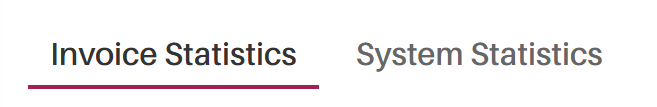

*Version: {{ page.meta.version }}*

# Dashboard

## Was ist der Hauptzweck dieser Seite

Auf dieser Dashboard-Seite finden Sie viele nützliche Tabellen und Statistiken,
die Ihnen helfen, Ihre Arbeit zu organisieren und einen Überblick zu erhalten.

Wenn Sie ein Superuser oder eine ähnliche Person mit Rechten zum
Beobachten aller Benutzer und Dokumente Ihres Unternehmens sind,
stehen Ihnen zusätzliche Visualisierungen und Tabellen zur Verfügung,
die Ihnen helfen, die Leistung der Benutzer und den zukünftigen Geldabfluss zu analysieren.

In den folgenden Absätzen finden Sie alle verschiedenen Tabellen und
Visualisierungen, die Ihnen zur Verfügung stehen.

## Übersicht

{width="1000"}

## Festlegen Ihres Zeitraums

Bevor Sie Analysen durchführen oder mit dem Dashboard interagieren,
müssen Sie zunächst den Zeitraum innerhalb des Dashboards definieren.
Der ausgewählte Zeitraum bestimmt, welche Dokumente in allen
Tabellen und Visualisierungen enthalten sind.

Um den Zeitraum zu ändern, klicken Sie auf das aktuelle Textfeld
für den Zeitraum oben auf dem Bildschirm und passen Sie es nach Ihren
Vorlieben an. Für detailliertere Informationen zur Änderung des Zeitraums
verweisen wir auf den [(folgenden Link)](Validations.md#changing-timetable),
der Sie zum entsprechenden Abschnitt dieses Handbuchs führt, in dem
das Untermenü zum Zeitraum genauer erklärt wird.

## Analyse allgemeiner Statistiken in den ersten Boxen

Eines der ersten Elemente, die Sie auf der Dashboard-Seite bemerken,
sind vier Boxen, die allgemeine statistische Informationen über Ihr System anzeigen.

#### Erste Ansicht

Zur besseren Identifizierung der referenzierten Boxen finden Sie unten
ein visuelles Beispiel, wie diese Boxen in Ihrem System aussehen.

{width="1000"}

#### Informationen in diesen Boxen

Diese Boxen enthalten allgemeine Informationen, die Ihnen helfen,
den aktuellen Zustand des Systems schnell einzuschätzen. Dies kann
nützliche Informationen liefern und Ihnen helfen, Ihre Aufgaben oder
Unternehmensoperationen entsprechend zu priorisieren.

## Navigation durch die verschiedenen Registerkarten

Auf der Dashboard-Seite sind alle Funktionen in separate Unterseiten
aufgeteilt. Sie können zwischen diesen Seiten navigieren, indem Sie
oben auf dem Bildschirm die Registerkarten wechseln.

Hier ein Beispiel, wie diese Registerkarten aussehen sollten:

{width="300"}

Die folgenden Abschnitte erklären die Funktionen, die auf jeder dieser Seiten verfügbar sind.

## Rechnungsstatistiken

Diese Unterseite des Dashboards zeigt statistische Informationen zu
Dokumenten an, die im ausgewählten Zeitraum freigegeben wurden.

!!! warning "Wichtige Information"
    Bevor Sie die aktuellen Dokumente im System analysieren, beachten Sie bitte,
    dass Sie, wenn Sie keine Berechtigung haben, die Validierungen anderer zu sehen,
    nur die von Ihnen freigegebenen Dokumente sehen werden.

Wir gehen nun jede verfügbare Visualisierung auf dieser Unterseite durch.

### Tabelle der ausstehenden Dokumentfreigaben

#### Übersicht

Diese Tabelle zeigt alle Dokumente, die derzeit in Ihrem System auf Freigabe warten.
Sie zeigt die Person, der jedes Dokument zugewiesen ist, sowie detaillierte
Informationen über die Anzahl und den Wert der Dokumente, für die jede Person
verantwortlich ist.

Unten sehen Sie ein Beispiel, wie diese Tabelle aussieht:

{width="1000"}

### Tabelle der freigegebenen Dokumente

#### Übersicht

Diese Tabelle zeigt alle Dokumente, die bereits in Ihrem System freigegeben wurden.
Jeder Eintrag enthält die Person, der das Dokument zugewiesen ist, sowie
verschiedene Statistiken wie Anzahl und Wert der pro Person freigegebenen Dokumente.
Darüber hinaus werden alle Dokumente, die ohne Zuordnung freigegeben wurden,
in einer separaten Zeile dargestellt (auch `"Unassigned Documents"` genannt).

Hier ist ein Beispiel, wie die Tabelle aussieht:

{width="1000"}

### Durchschnittliche Freigabedauer

#### Übersicht

Dieses Histogramm zeigt die durchschnittliche Zeit, die jede Person benötigt,
um zugewiesene Dokumente freizugeben.

Zur Veranschaulichung hier ein Beispiel:

{width="1000"}

#### Navigation im Histogramm

Jede Zeile stellt ein Teammitglied und die durchschnittliche Freigabezeit
für diese Person dar. Je nach Farbe der Box kann der angezeigte Durchschnitt
beziehen auf:

- Die Durchschnittsdauer innerhalb des definierten Zeitraums, oder
- Die Gesamtdurchschnittszeit über alle Dokumente hinweg.

Um zwischen **eingehenden** und **ausgehenden** Dokumenten zu wechseln,
verwenden Sie die Registerkarten oben im Histogramm.

Um eine Kategorie (`"Im Zeitraum"` oder `"Gesamt"`) auszublenden,
klicken Sie einfach auf das entsprechende Label oben im Histogramm.

### Vorlagenstatistiken

#### Übersicht

Dieser Unterabschnitt ermöglicht es Ihnen, die Leistung jeder Vorlage
im ausgewählten Zeitraum zu visualisieren.

!!! warning "Wichtige Information"
    Bitte beachten Sie, dass diese Seite leer erscheint, wenn Sie nicht die
    erforderlichen Berechtigungen zum Erstellen oder Ändern von Vorlagen haben.

Hier ein Beispiel, wie diese Seite aussieht:

{width="750"}

#### Navigation innerhalb dieser Unterseite

Jede verwendete Vorlage innerhalb des definierten Zeitraums wird als einzelne
Kachel angezeigt. In jeder Kachel finden Sie die Extraktionsgenauigkeitsmetriken
für jedes mit dieser Vorlage verbundene Feld.

Wenn Sie eine bestimmte Vorlage bearbeiten möchten, können Sie dies direkt
durch Klicken auf das Bearbeitungssymbol in der oberen rechten Ecke der
Vorlagenkachel tun. Das Bearbeitungssymbol sieht wie folgt aus:

{align=center width="60"}

## Systemstatistiken

Diese Unterseite bietet einen Überblick über statistische Informationen
zur Gesamtleistung des Systems während des ausgewählten Zeitraums.

!!! warning "Wichtige Information"
    Da keine sensiblen Informationen in diesen Visualisierungen enthalten sind,
    haben alle Benutzer vollständigen Zugriff auf diese Unterseite.

Ein Beispiel für das Layout dieser Seite finden Sie unten:

{width="1000"}

### Navigation durch die Visualisierungen

Wenn Sie diese Seite scrollen, begegnen Ihnen verschiedene Histogramme
und andere visuelle Darstellungen. Folgende Interaktionsmöglichkeiten stehen zur Verfügung:

- Um bestimmte Werte oder zusätzliche Informationen zu einem Datenpunkt
  in einer Visualisierung anzuzeigen, bewegen Sie den Mauszeiger darüber.
  Ein Tooltip erscheint mit detaillierten Informationen.

- Einige Visualisierungen bieten Parameter-Registerkarten, mit denen Sie
  die angezeigten Daten filtern oder anpassen können. Wechseln Sie dazu
  zwischen den verfügbaren Registerkarten.

## Aufgabenliste

### Übersicht

In dieser Liste werden die verschiedenen Validierungen angezeigt, die
derzeit Ihnen zugewiesen sind und von Ihnen bearbeitet werden sollen.

!!! note
    Bitte beachten Sie, dass alle in der Aufgabenliste angezeigten Validierungen
    nur entsprechend dem ausgewählten Zeitraum erscheinen.

Die Aufgabenliste befindet sich am Anfang des Dashboards und sollte wie folgt aussehen:

{width=800}

### Direktes Interagieren mit einer oder mehreren Validierungen

Um eine Validierung direkt zu visualisieren, klicken Sie einfach auf die
Anzeigen-Schaltfläche der jeweiligen Validierung.

Wenn Sie mehrere Validierungen gleichzeitig ansehen möchten, können Sie
alle gewünschten Validierungen in der Tabelle auswählen und auf die
Anzeigen-Schaltfläche einer Validierung klicken, um alle Validierungen
im System zu öffnen.