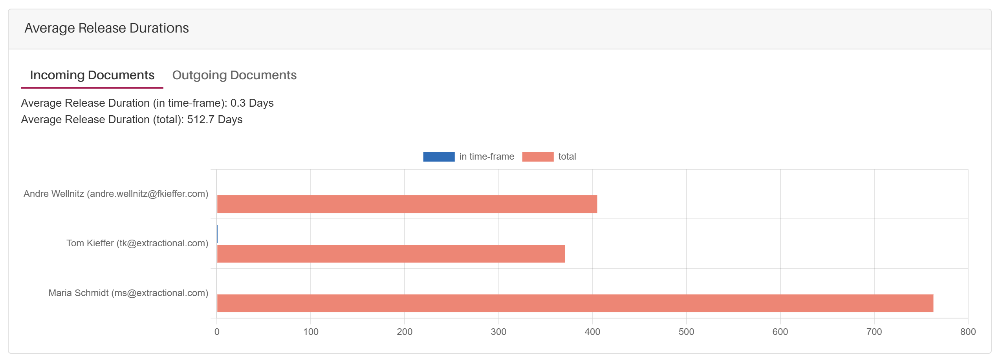

# Tableau de bord

## Quel est l'objectif principal de cette page

Dans cette page de tableau de bord, vous trouverez de nombreux tableaux et statistiques utiles
qui vous aideront à organiser et à avoir une vue d'ensemble de votre travail.

Si vous êtes un super utilisateur ou une personne disposant de droits
pour observer tous les utilisateurs et documents de votre entreprise, vous aurez également
des visualisations et tableaux supplémentaires à votre disposition pour analyser
la performance des utilisateurs et les flux de trésorerie futurs.

Dans les paragraphes suivants, vous trouverez tous les différents tableaux et
visualisations disponibles.

## Aperçu

{width="1000"}

## Définir votre période

Avant de réaliser une analyse ou d’interagir avec le tableau de bord, il est
essentiel de définir d’abord la période dans le tableau de bord. La
période sélectionnée détermine quels documents seront inclus dans tous
les tableaux et visualisations disponibles.

Pour modifier la période, cliquez sur la zone de texte de la période actuelle
située en haut de l’écran et ajustez-la selon vos préférences. Pour plus
d’informations sur la modification de la période, veuillez consulter le [(lien suivant)](Validations.md#changing-timetable),
qui vous dirigera vers la section pertinente de ce manuel où le sous-menu
de la période est expliqué en détail.

## Analyse des statistiques générales dans les premières cases

Un des premiers éléments que vous remarquerez sur la page du tableau de bord
est quatre cases affichant des informations statistiques générales sur votre système.

#### Première vue

Pour aider à identifier les cases référencées, un exemple visuel de leur apparence
dans votre système est fourni ci-dessous.

{width="1000"}

#### Informations fournies dans ces cases

Ces cases contiennent des informations générales conçues pour vous aider à
évaluer rapidement l’état actuel du système. Cela peut fournir des informations
utiles et vous aider à prioriser vos tâches ou opérations de l’entreprise.

## Navigation entre les différents onglets

Sur la page du tableau de bord, toutes les fonctionnalités sont divisées en sous-pages.
Vous pouvez naviguer entre ces pages en changeant d’onglet en haut de l’écran.

Voici un exemple de l’apparence de ces onglets :

{width="300"}

Les sections suivantes expliquent les fonctionnalités disponibles sur chacune de ces pages.

## Statistiques des factures

Cette sous-page du tableau de bord affiche des informations statistiques liées
aux documents émis pendant la période sélectionnée.

!!! warning "Information importante"
    Avant d’analyser les documents présents dans le système, veuillez noter que
    si vous n’avez pas l’autorisation de voir les validations des autres,
    vous ne verrez que les documents que vous avez émis.

Nous allons maintenant passer en revue chaque visualisation disponible sur cette sous-page.

### Tableau des documents en attente de validation

#### Aperçu

Ce tableau affiche tous les documents actuellement en attente de validation
dans votre système. Il montre la personne à qui chaque document est attribué,
ainsi que des informations détaillées sur le nombre et la valeur des documents
dont chaque individu est responsable.

Voici un exemple de l’apparence de ce tableau :

{width="1000"}

### Tableau des documents validés

#### Aperçu

Ce tableau affiche tous les documents déjà validés dans votre système.
Chaque entrée inclut la personne à qui le document est attribué, ainsi que
diverses statistiques, telles que le nombre et la valeur des documents
validés par individu. De plus, tous les documents validés sans personne
assignée seront représentés dans une ligne distincte (appelée également
`"Documents non assignés"`).

Voici un exemple de l’apparence du tableau :

{width="1000"}

### Durée moyenne de validation

#### Aperçu

Cet histogramme montre le temps moyen que chaque personne prend pour valider
les documents qui lui sont assignés.

Pour mieux comprendre, voici un exemple de visualisation :

{width="1000"}

#### Navigation dans l’histogramme

Chaque ligne représente un membre de l’équipe avec le temps moyen de validation
pour cet individu. Selon la couleur de la case, la moyenne affichée peut se référer à :

- La durée moyenne pendant la période définie, ou
- La durée moyenne totale sur l’ensemble de ses documents.

Pour passer entre les documents **entrants** et **sortants**, utilisez les onglets
en haut de l’histogramme.

Pour masquer une catégorie (`"Dans la période"` ou `"Total"`), cliquez simplement
sur le label de la catégorie en haut de l’histogramme.

### Statistiques des modèles

#### Aperçu

Cette sous-section vous permet de visualiser la performance de chaque modèle
utilisé pendant la période sélectionnée.

!!! warning "Information importante"
    Veuillez noter que si vous n’avez pas les permissions nécessaires pour
    créer ou modifier des modèles, cette page apparaîtra vide.

Voici un exemple de l’apparence de cette page :

{width="750"}

#### Navigation dans cette sous-page

Chaque modèle utilisé pendant la période définie est affiché comme une tuile
individuelle. Dans chaque tuile, vous trouverez les métriques de précision
d’extraction pour chaque champ associé à ce modèle.

Si vous souhaitez modifier un modèle spécifique, vous pouvez le faire directement
en cliquant sur l’icône d’édition située en haut à droite de la tuile.
L’icône d’édition apparaît comme suit :

{align=center width="60"}

## Statistiques du système

Cette sous-page fournit un aperçu des informations statistiques liées à la
performance globale du système pendant la période sélectionnée.

!!! warning "Information importante"
    Étant donné qu’aucune information sensible n’est présentée dans ces visualisations,
    tous les utilisateurs ont un accès complet à cette sous-page.

Voici un exemple de mise en page de cette page :

{width="1000"}

### Navigation dans les visualisations

En faisant défiler cette page, vous rencontrerez différents histogrammes
et autres types de représentations visuelles. Les fonctionnalités d’interaction
suivantes sont disponibles :

- Pour voir des valeurs spécifiques ou des informations supplémentaires pour un point
  de données particulier dans une visualisation, survolez-le avec la souris.
  Une infobulle apparaîtra avec des détails.

- Certaines visualisations offrent des onglets de paramètres permettant de filtrer
  ou d’ajuster les données affichées. Pour changer les paramètres, passez
  entre les onglets disponibles.

## Liste de tâches

### Aperçu

Dans cette liste, nous visualiserons les différentes validations actuellement
assignées à vous et qui doivent être traitées par vous.

!!! note
    Veuillez noter que toutes les validations affichées dans la liste de tâches
    apparaissent uniquement en fonction de la période sélectionnée.

La liste de tâches se trouve au début du tableau de bord et devrait ressembler à ceci :

{width=800}

### Comment interagir directement avec une ou plusieurs validations

Pour visualiser directement une validation, cliquez simplement sur le bouton
de visualisation de la validation correspondante.

De plus, si vous souhaitez visualiser plusieurs validations en même temps,
vous pouvez sélectionner toutes les validations souhaitées dans le tableau
et cliquer sur le bouton de visualisation d’une des validations pour ouvrir
toutes les validations dans le système.
