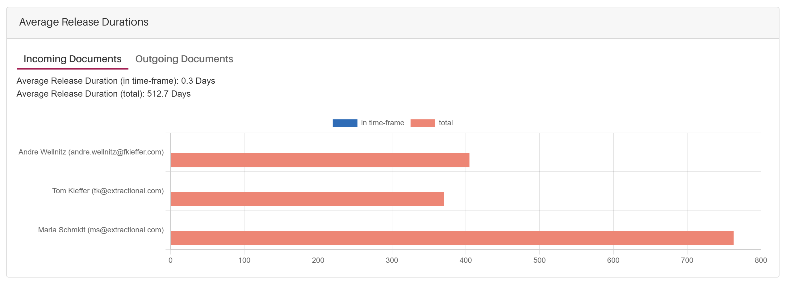
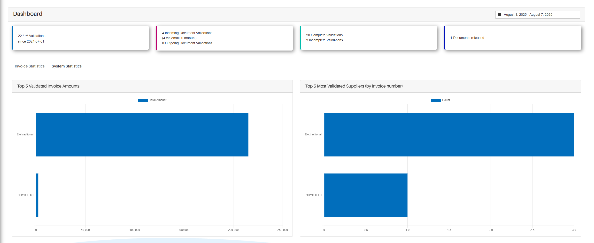

# Dashboard

## What is the main purpose of the this page

In this dashboard page you will find many useful tables and statistics
that will help you organize and overview your work.

If you are a super user or a similar person who has the rights to
observe all of your companies users and documents, you will also have
some additional visualizations and tables at your own disposal helping
you analyse the performance of the users and the future money outflow.

In the following paragraphs, you shall find all the different tables and
visualizations that are at your disposal.

## Overview

{width="1000"}

## Defining your Time Period

Before performing any analysis or interacting with the dashboard, it is
essential to first define the time period within the dashboard. The
selected time period determines which documents will be included in all
tables and visualizations available for use.

To modify the time period, click the current time period text box
located at the top of the screen and adjust it according to your
preferences. For more detailed information on how to change the time
period, please refer to the [(following link)](Validations.md#changing-timetable),
which will redirect you to the relevant section of this manual where the
time period submenu is explained in greater detail.

## Analysing General Statistics in the Initial Boxes

One of the first elements you will notice on the dashboard page are four
boxes displaying general statistical information about your system.

#### First Look 

To help identify the boxes referenced, a visual example of how these
boxes appear in your system is provided below.

{width="1000"}

#### Information Provided in These Boxes 

These boxes contain general information designed to help you quickly
assess the current state of the system. This can provide useful
information and help you prioritize your tasks or company operations
accordingly.

## Navigation Through the Different Tabs

On the Dashboard page, all features are divided into separate subpages.
You can navigate between these pages by switching tabs at the top of the
screen.

Here is an example of what these tabs should look like:

{width="300"}

The following sections explain the features available on each of these
pages.

## Invoice Statistics

This subpage of the dashboard displays statistical information related
to documents released within the selected time period.

!!! warning "Important information"
    Before analysing the documents currently in the system, please note that
    if you do not have permission to view others' validations, you will only
    see documents released by you.

We will now walk through each visualization available on this subpage.

### Pending Document Releases Table

#### Overview 

This table displays all documents that are currently pending release in
your system. It shows the person each document is assigned to, along
with detailed information about the number and value of documents each
individual is responsible for releasing.

Below is an example of how this table appears:

{width="1000"}

### Released Documents Table

#### Overview 

This table displays all documents that have already been released in
your system. Each entry includes the person the document is assigned to,
as well as various statistics, such as the number and value of documents
released per individual. In addition, all the documents that have been
released without some one assigned to it will be represented in a
separate representative row (also called `"Unassigned Documents"`).

Here is an example of what the table looks like:

{width="1000"}

### Average Release Durations

#### Overview 

This histogram shows the average time each individual takes to release
assigned documents.

To aid your understanding, here is an example visualization:

{width="1000"}

#### Navigating the Histogram 

Each row represents a team member along with the average release time
for that individual. Depending on the box color, the displayed average
may refer to either:

-   The average duration within the defined time period, or

-   The overall average release time across all their documents.

To switch between **Incoming** and **Outgoing** documents, use the tabs
at the top of the histogram.

To hide one of the categories (`"In Time-Frame"` or `"Total"`), simply
click on the respective category label at the top of the histogram.

### Template Statistics

#### Overview 

This sub-section allows you to visualize the performance of each
template used during the selected time period.

!!! warning "Important information"
    Please note that if you do not have the necessary permissions to create
    or modify templates, this page will appear empty.

Below is an example of what this page looks like:

{width="750"}

#### Navigating Within This Subpage 

Each template used within the defined time period is displayed as an
individual tile. Within each tile, you will find extraction accuracy
metrics for each field associated with that template.

If you wish to edit a specific template, you can do so directly by
clicking the edit icon located in the top-right corner of the template
tile. The edit icon appears as follows:

{align=center width="60"}

## System Statistics

This subpage provides an overview of statistical information related to
the overall system performance during the selected time period.

!!! warning "Important information"
    Since no sensitive information is presented in these visualizations, all
    users are granted full access to this subpage.

An example of this page layout is shown below:

{width="1000"}

### Navigating Through the Visualizations

As you scroll through this page, you will encounter various histograms
and other types of visual representations. The following interaction
features are available:

-   To view specific values or additional information for a particular
    data point within a visualization, simply hover your mouse over it.
    A tooltip will appear with detailed information.

-   Some visualizations offer parameter tabs that allow you to filter or
    adjust the displayed data. To change the parameters, switch between
    the available tabs.

## To-Do List

### Overview

In this list, we will be visualized with the different validations that are currently assigned to you and that shall be treated by you.

!!! note
    Please pay attention that all validations shown in the to-do list only appear accordingly to the time period that has been selected.

The to-do list shall be positioned at the beginning of the dashboard and should look like this:

{width=100}

### How to directly interact with one or several validations

In order to directly visualize one visualization, you will simply need to click on the view button of the respective validation.

Additionally, if you would like to view several validations at the same time, can select all the desired validations in the table and click on the view button of one of the validations and all the validations will be opened in the system.
