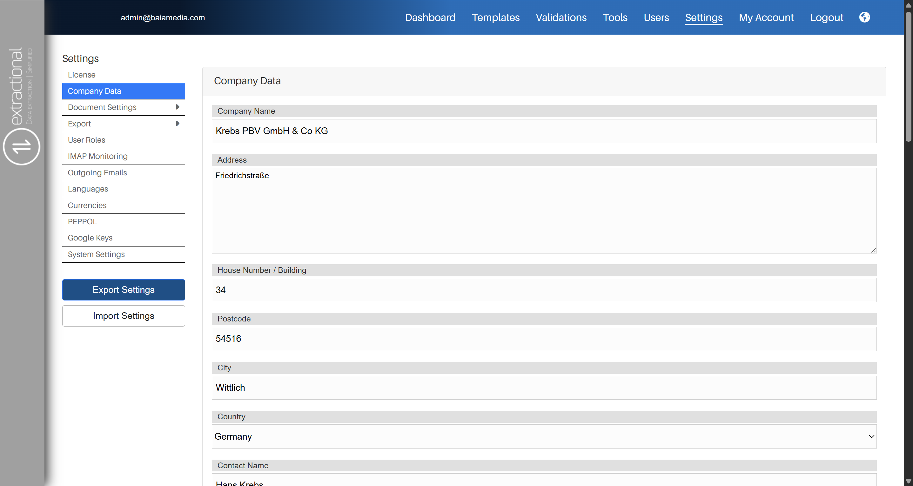
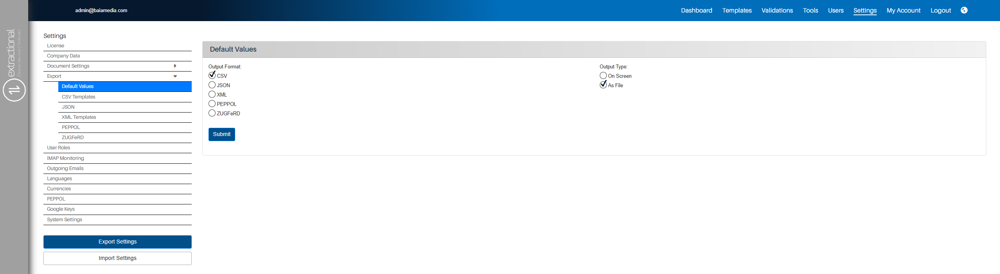
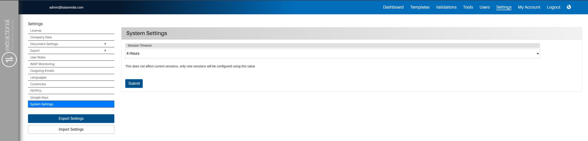

*Version: {{ page.meta.version }}*

# Settings

!!! danger "Annonce importante"
    Cette page est encore en cours de traduction dans votre langue. Pour le moment, vous pouvez utiliser cette page en anglais.

## What is the main Purpose

In this part of this system, you will be able to define the major
behaviour of your system. It is also where you shall define all of your
templates, roles, etc. It is highly recommended that you go through the
settings page and define everything that your system shall need before
you put this system into use in your company.

The system settings are separated into several subpages. To decrease the
complexity of the explanation of the several subpages, we have divided
each subpage into it's own section in our user manual.

## Overview

{width="750"}

<h2>Video tutorials</h2>

<h3>Configuring your outgoing e-mails</h3>

<iframe src="https://www.youtube.com/embed/kAnn2yW7CWw?si=tt-yfJh97ZgbK2Yk" frameborder="0" allow="accelerometer; autoplay; clipboard-write; encrypted-media; gyroscope; picture-in-picture; web-share" referrerpolicy="strict-origin-when-cross-origin" allowfullscreen></iframe>

<h3>Establishing an IMAP connection</h3>

<iframe src="https://www.youtube.com/embed/GMifEmqwnOQ?si=8tJTT6ioCe8wVN_L" frameborder="0" allow="accelerometer; autoplay; clipboard-write; encrypted-media; gyroscope; picture-in-picture; web-share" referrerpolicy="strict-origin-when-cross-origin" allowfullscreen></iframe>

<h3>Document Settings</h3>

<iframe src="https://www.youtube.com/embed/Iog6QD7HkVY?si=BoiuSlBotyxOtU5P" frameborder="0" allow="accelerometer; autoplay; clipboard-write; encrypted-media; gyroscope; picture-in-picture; web-share" referrerpolicy="strict-origin-when-cross-origin" allowfullscreen></iframe>

---

## License

In this first subpage you can find all the information about the current
license that your system is currently using. Additionally you can also
change some of the parameters such as if you would like to activate the
auto renewal system or not.

### Buying or changing your license

If you would like to buy or change the license of your system, you must
enter this page in order to do it.

Once you have entered this page, you will need to click on the
`Buy/Change License` button that is positioned at the bottom right
corner of the page. A representation of the button can be seen below
this sentence.

{width="250"}

Once you have clicked on this button, you will be redirected to another
page where you will be able to choose the plan that you like to buy or
renew.

## Company Data

In this subpage, you will define all of your company's data. It is in
this subpage where you shall add and modify all of your company's bank
account(s) information.

### Overview

{width="1000"}

### Making some changes to the company(s) information

If you would like to add or change any data related to your company's
information, you shall change it by simply clicking in the respective
fields that you would like to change the information. You will then have
the possibility to change the data by typing the new values or simply
selecting one of the options possible, this will depend on the field
that you would like to change.

Once you have made all of your changes, you will simply need to submit
you changes by clicking on the submit button on the bottom of the page.

### Changes in the Bank information subpage

If you would to modify one of your company account(s) or add/remove one,
you shall do it in the Bank information tile that is shown at the bottom
of the page.

{width="750"}

#### Modifying an existing account 

To modify an existing account, you will simply need to do the same
manipulation as before (to change the company's information) in the
desired field(s) time.

Once all changes have been made, you will only need to click on the
`Submit` button in order to save your changes.\

#### Adding a new account 

In order to add a new account into the system, you will need to click on
the plus icon that is shown on the bottom of the account's page. Once
you have clicked on the plus icon, a new account representation tile
will pop-out, and you will have the possibility to add all the
information of this new account that you would like to add.

Once you have entered all the information for the new account, you will
only need to click on the `Submit` button to save your changes.

#### Deleting an existing account 

If you would like to remove an existing account, you can do so by
clicking on the trash bin icon of the respective account, and the
account will be removed. The trash bin icon can be found on the top
right corner of the respective account representative tile.

---

<!-- <h2 id=analysis-fields>Document Settings - Analysis Fields</h2> -->

<h1>Document Settings</h1>

## Analysis Fields

In this subpage of Settings, you can define all the data that shall be
extracted from each type of document that is being read.

### Overview

{width="1000"}

### How to navigate and define all fields

Firstly, to navigate through the system, use the different tabs that can
be found at the top of the page. These different tabs allow one to
navigate between each type of document will be defined for extraction.

#### Visualizing all elements that are being extracted 

To visualize all the elements that are currently being extracted from
the system, you can do so by analysing all the elements that do have the
select box selected. To help you visualize what a selected element is,
you can find a visualization of an element that is being extracted in
the system.

{width="300"}

#### Understanding the field's definition 

To understand how a certain field extraction unit has been defined, you
will need to understand what each category that defines a field
abstraction is.

Each field has the following elements:

=== "General field name"
    
    The **general field name** will define the name that you will see in the
    system's graphical user interface. This name is defined in each language
    of the program.

=== "Output name"

    The **output name** is the technical name that will be used further on
    to create XML relations and to implement on further templates or
    automations. This name must be unique and must be single-worded.

=== "Field format"
    The **field format** defines the format of this entity with regular
    expressions. It is in this case where you will be able to define the
    length of each field as well as define the type of intput the field
    shall always receive (words,numbers, etc.).

=== "Default"
    The **default** case is where you are able to define a default value for
    your entity in case if the system does not find any value.

=== "Type"
    In the **type** case you can define how this input shall be identified
    in our system. For example, if you would like that our system identifies
    these entities as data, here you shall define it.

=== "Decimals"
    In case you are dealing with numbers, you will also be able to define
    how many decimal numbers are allowed in the system. This can be easily
    defined in the **decimals** box. Additionally, if our system receives as
    an input a number with more decimals than what you have defined, the
    system will automatically round the number to the number of decimals
    allowed.

=== "Selective options"
    For the selective option, you will be able to define if this field shall
    be included in filters, meaning that if selected, you can use it when
    filtering. You will also be able to define if you allow type-in,in other
    words, allowing to use that manual selections can also be applied for
    that field. Moreover, you will also be able to define if that field is
    required or not, meaning that once a field is required, it cannot be
    left blank.

Now that you understand the definition of a certain field, you can now
define all the fields that your system shall extract, and if none of the
fields corresponds to what you would like to extract in the documents,
you can always create more fields by clicking on the plus icon at the
bottom of the table.

#### Difference between the two tables 

There are two tables where you can define your fields. It is important
to define your fields in the correct table. We will now explain what
each table means.

=== "{width=20 align=left} First table"
    In the first table, you define all the fields that the system will
    extract from each document. Generally, here you shall define all the
    different fields that are more general for the whole document, such as
    the client name or the total sum to pay.

=== "{width=20 align=left} second table"
    In the second table, you shall define all the different fields that are
    specific for generating Peppol compliant data. In other words, you shall
    only define all the fields that you want in your table of items of
    products in the document.

---

## Document Tables

In this subpage of the settings you will be able to define what you
would like to have visible in the document table the is situated in the
Validations page.

In this page you will be able to define how each one(s) document page
would look like.

### Overview 

{width="1000"}

### How to interact in this page

As you can see, this page is composed of a table full with all
information that will be extracted in the system. In each one of the
fields, you will be able to choose how it shall be visible in the
documents page. We will now explain what each column actually does.

!!! note
    Some of the fields are already predefined and you will not be able to
    make any changes in it.

#### Column Mode 

In this column you will be able to define what all the the visibility
for each field. You have three options:

-   Disabled: this field will not appear at all in the table and will
    not be chosen as an search criteria when searching for a file.

-   Hidden: this field will not appear at all in the table, but it will
    be considered when searching for a file in the search bar.

-   Enabled: this field will appear in the table of documents and will
    also be considered when searching for a file in the search bar.

#### Column alignment 

In the following column, you can specify how each file should be aligned
in the table.

!!! note
    You only need to define this column if you have defined the `Column
    mode` as **Enabled**.

You can choose between the following options:

-   Left alignment

-   Centered alignment

-   Right alignment

#### Selective columns 

!!! note
    There are two selective columns for each one of the fields. These shall
    only be put into consideration once the `Column mode` is set to
    **Enabled**.

The **Searchable** selective column allows you to define whether the
field is considered when searching for a document in the search bar.

The **Sortable** selective column allows you to define whether the field
can be used to sort the document's list or not.

---

## Document Flags

In the following page, you will be able to define and modify all of your
document flags.

### Overview

{width="1000"}

### Understanding the page layout

This page represents all the document's flags in a table. In this table,
each flag is represented in a row. Modifying, creating new flags, or
deleting existing flags can be done by clicking on several buttons or
icons. Each functionality shall now be explained in the following
sections.

### Modifying the current flag(s) list

In this part, you will learn to modify your current company(s) flag
list.

!!! note
    If you would like to change or add flag automation together with
    exportation, you shall define it in the [export
    page](#default-export-values).

#### Adding a new flag 

In order to add new flag into the system, you will need to firstly click
on the plus icon that can be found on the bottom of the page. Once
clicked, you shall be represented with the following window.

{width="200"}

You will now need to insert the name of the new flag in all the
corresponding languages as well as defining a corresponding icon with
the respective color.

Once you have defined all the different fields, click on the `Ok`
button at the bottom of this window. If the manipulation has been
successful, you shall be able to see the new flag in the flag(s) list.

#### Editing an existing flag 

If you would like to modify an(some) element(s) of an existing flag, you
will need to click on the flags name that you would like to modify in
the respective list.

Once clicked, you will be represented with the same window as for
creating a new flag but this time with all the selected flag's
information. You can now modify all the desired information in the
respective fields.

Once all the modifications have been made, you will need to click on the
`Ok` button at the bottom of the page and all the changes will be
saved in the system.

#### Deleting an existing flag 

In order to delete an existing flag, you will need to click on the
delete icon of the respective Document. This icon can be found at the
end of each document flag.

Once clicked on the desired flag, the flag will be successfully removed
from the system.

---

<h1>Export</h1>

## Default export Values

In this page, you can define the default values in the system's export
menu.

### Overview

{width="1000"}

### Defining the new default values

If you would like to change the default values for exportation, you will
need to simply select the desired values in this page and click on the
`Submit` button at the bottom of the page.

## Export CSV Templates

This page is responsible for defining all the different CSV templates
available in the system.

### Overview

{width="1000"}

### Navigating through the page

This page follows a similar layout to the validations page. Each
template is represented in the table as a row. You will be able to
define how many templates you would like to have per page in the
respective selective field. You can change between pages on the
navigation buttons.

You can also look for a specific template by typing it's name or
document type in the search bar.

### Adding a new template

In this part, you shall find a guide on how to add a new CSV template
from scratch.

=== "Start"

    The first thing to do will be to click on the \"Add\...\" button at the
    bottom of this page to trigger the system that you would like to add a
    new template.

    Once clicked, you shall be presented with the following additional
    information on the page.

    {width="800"}

    You will now need to define all the general characteristics of the new
    template. Once you have defined all the different general
    characteristics of the new template (Name, Document type, Set flags
    after export, Number format), you will need to add all the columns for
    exportation.

=== "Defining all columns" 

    All the different columns of a certain CSV template are available in the
    `CSV Columns` tile at the bottom of the page. In order to add a new
    column into the system, you will need to click on `Add...` button and
    you should be presented a new column entity.

    {width="750"}

    You will not be able to define the field value that shall be inserted in
    that column as well as to define the columns name.

    In addition, you will be able to change the order of the columns by
    grabbing (left clicking on the field) the field that you would like to
    move and placing it where you would like.

=== "Submitting the new template" 

    Once all the information has been added to this new template, you need
    to click on the `Submit` button at the bottom of the page to save this
    new template in the system.

### Editing an existing template

In order to change an existing template, you will need to start by
clicking on the edit button of the respective template.

The system will then display all relevant details for that specific
template using the same layout as when creating a new template.

You will now be able to change all the different characteristics of that
template as well as changing all the different columns of that template.
The columns manipulation will work in the same way as when creating a
new template.

### Additional features

-   :fontawesome-solid-pen-to-square: __Editing templates__

    ---

    In order to remove on of the templates, you will need to click on the
    `delete` icon that is visible at the right side of each template.
    After clicking on the remove icon, the template will be successfully
    removed.

-   :fontawesome-solid-user: __Defining default templates__
    
    ---

    You can also define all default templates for each type of document
    (Invoice, Credit Note, etc.). To do so, you will need to select, in the
    `is default` column the template that you would like to have as
    default. The previously default template for that type of document will
    be automatically unselected.

<!-- ### Editing templates

In order to remove on of the templates, you will need to click on the
\"delete\" icon that is visible at the right side of each template.
After clicking on the remove icon, the template will be successfully
removed.

### Defining all Default templates

You can also define all default templates for each type of document
(Invoice, Credit Note, etc.). To do so, you will need to select, in the
\"is default\" column the template that you would like to have as
default. The previously default template for that type of document will
be automatically unselected. -->

## Export JSON

In this page, you will be able to define all automations with flags for
all JSON exportations.

### Overview

{width="1000"}

### Setting flags after exportation

You can automate the system to automatically set a(some) flags to a
certain document once it as been exported as a JSON file. This can be
done by simply selecting the flags that you like to be added once a
document as been exported as a JSON file.

## Export - XML Templates

On this page, you can define all the XML templates available in the
system. Navigation works in the same way as on the **Export -- CSV
Templates** page, with the main difference being the **Template Data**
section, which appears when editing an existing template or creating a
new one.

### Template Data

In this section of the page you will be able to define the main template
format and items that shall be used for exportation afterwards. The
template shall be written in XML and if you would like to refer to one
of the system's fields, you shall use the following notation
**\@some_field@**

There are three main templates that shall be defined:

=== ""Main" XML template"

    defining all information that shall be
    released regarding the main content of the document.

=== "XML template for line items"

    defining all the information that shall
    be released regarding each item of the document. This part will only
    be activated if you are exporting an **Peppol compliant** document.

=== "XML template for payments"

    defining all the information that shall
    be released for XML payments (typically SEPA transaction XML files).

## Export PEPPOL/ZUGFeRD

On these pages, you can define all flag-based automations for
PEPPOL/ZUGFeRD exports. The layout and navigation are identical to the
**Export -- JSON** page. For a more detailed explanation of how these
pages work, refer to [the corresponding section](#export-json)
of this manual.

---

## User Roles

In this page, you will be able to define all the different User roles
that you would like to have in your system, as well as defining the
permissions for each one of the users.

### Overview

{width="1000"}

### Navigation through the page

On this page, you will find a set of tiles, each representing a user
role. Inside each tile, you can see all available permissions in the
system, along with the corresponding selection boxes. The selected
options indicate the permissions currently assigned to that specific
user role.

### General manipulations

-   :fontawesome-solid-plus: __Add a new user role__

    ---

    To add a new user role in the system, click the `"New..."` button
    located at the bottom of the page. A window will appear, prompting you
    to enter the name of the new user role in each language supported by the
    system. Once completed, click the `"Submit"` button to confirm.

-   :fontawesome-solid-pen-to-square: __Changing permissions of a user role__
    
    ---

    To define or modify the permissions of an existing user role, simply
    select or deselect the relevant permission(s). After making your
    changes, click the `"Submit"` button at the bottom of the page to save
    them.

-   :fontawesome-solid-file-signature: __Renaming user role__

    ---

    To rename an existing user role, click the edit button in the top-right
    corner of the corresponding role's tile. A new window will open,
    allowing you to update the role's name in each language. When finished,
    click the `"Submit"` button at the bottom of this window to save the
    changes.

<!-- ### Adding a new user role

To add a new user role in the system, click the `"New..."` button
located at the bottom of the page. A window will appear, prompting you
to enter the name of the new user role in each language supported by the
system. Once completed, click the `"Submit"` button to confirm.

### Defining or changing permissions for a user role

To define or modify the permissions of an existing user role, simply
select or deselect the relevant permission(s). After making your
changes, click the `"Submit"` button at the bottom of the page to save
them.

### Renaming a user role

To rename an existing user role, click the edit button in the top-right
corner of the corresponding role's tile. A new window will open,
allowing you to update the role's name in each language. When finished,
click the `"Submit"` button at the bottom of this window to save the
changes. -->

---

## IMAP Monitoring

In this page, you will be able to define the IMAP connection with your
email(s) so that all the documents that will be received in your email
will be directly inserted into the system.

### Overview

{width="1000"}

### How to set a new e-mail in the system

!!! warning "Important"
    This part will highly depend on your email domain. If your domain allows
    IMAP connection with no additional authentication, please follow the
    following the first part of this section. If, however, your system needs
    additional OAuth authentication, please follow the second part of this
    section.

#### 1. Adding an email with simple IMAP connection 

For a simple IMAP connection you shall simply enter all of your e-mail's
coordinates, such as mail server and. You also need to enter all your
email and password.\
Once entered all of your credentials, you will need to define weather
you would like all e-mails to be automatically deleted or not. This
shall be handled with care since deleted email messages cannot be be
recovered.\
You can now check if your system succeeds connection by clicking on the
\"Check Connection\" button, and a new window will pop-out showing you
the respective result.

{width="500"}
/// caption
Example when connection is successful
///

??? info
    If you are having issues trying to connect to the system, first verify
    if your email provider allows simple IMAP monitoring. A typically issue
    is also the Port number and Security protocols that are not correctly
    defined.

Once your email has been successfully added, you will need to click on
the `Submit` button at the bottom of the page and your changes will be
saved.

#### 2. Adding an e-mail with OAuth connections 

!!! note
    Currently, our system only allows OAuth connection with Outlook emails,
    any other domains that need this type of connection will will not work
    in our system unfortunately.

The first step will be to trigger the system to create such a connection.
To do so, you will need to enter the mail server and deselect the box,
meaning, for example, right-clicking outside the box.

The system will automatically detect if your domain needs OAUth
connection and if so, you will need to insert the additional information
that is needed for this type of connection.

For **Outlook** accounts you will need to add the following additional
information that is listed bellow.

-   :fontawesome-solid-address-card:{ .lg .middle } __Microsoft Tenant Id__

    ---

    For more informations, please use the following 
    [:octicons-arrow-right-24: link](https://learn.microsoft.com/en-us/sharepoint/find-your-office-365-tenant-id)

-   :fontawesome-brands-microsoft:{ .lg .middle } __Microsoft Application Id__

    ---

    For more informations, please use the following 

    [:octicons-arrow-right-24: link](https://learn.microsoft.com/en-us/sharepoint/find-your-office-365-tenant-id)

-   :fontawesome-solid-key:{ .lg .middle } __Client Secret key__

    ---

    For more information on how to get this Id, please use the following
    [:octicons-arrow-right-24: link](https://learn.microsoft.com/en-us/entra/identity-platform/quickstart-register-app)

<!-- -   `Microsoft Tenant Id` : For more informations, please use the
    following
    [link](https://learn.microsoft.com/en-us/sharepoint/find-your-office-365-tenant-id)

-   `Microsoft Application Id` : For more information on how to get this
    Id, please use the following
    [link](https://learn.microsoft.com/en-us/entra/identity-platform/quickstart-register-app)

-   `Client Secret key` : For more information on how to get this Id,
    please use the following
    [link](https://learn.microsoft.com/en-us/entra/identity-platform/quickstart-register-app) -->

You will then need to fill all the rest of the fields as for a simple
IMAP connection e-mail and verify your connection as previously
explained.

### Adding an additional email

If you would like to add an additional account to the system, it is as
simple as clicking on the plus icon that can be found at the bottom of
the page. Then a new tile for the email entity will be visible on the
page.

You can now add all your additional email credentials in the same way
that you have inserted for the first account.

### Deleting an existing account

!!! note
    You can only remove additional e-mails; the main e-mail (first in the
    list) cannot be removed.

In order to remove an existing e-mail, you shall click on the `remove`
icon of the respective email that you would like to remove.

Once your email has been successfully added, you will need to click on
the `Submit` button at the bottom of the page and your changes will be
saved.

---

## Outgoing Emails

In this page, you can define the email connection for all outgoing
e-mails in the system.

### Overview

{width="1000"}

### Setting up the email connection

Our system, in order to send emails with a given email, uses a SMTP(S)
transport protocol connection.

#### Prerequisites 

In order to realize this connection, you first need to make sure that
your email host domain allows you to elaborate such a connection.

If you are currently trying to connect to an professional outlook
account, please use the following [paragraph](#outlook-connection)
that explains exactly how to establish a connection to a an outlook
account.

#### Filling all your email's credentials

Now that you already know that your e-mail allows this type of
connection, you will only need to create fill all the different fields
in `SMTP Server` section of the page and your system should have a
successful connection with your email.

Please do not forget to save your changes by clicking on the `Submit`
button on the bottom of the page.

#### Outlook connection 

Our system also provides the ability to connect your system to an
outlook account. In order to trigger the system that you would like to
connect to an outlook account, you will need to enter the Outlook's SMTP
Server `smtp.office365.com` in the `Host` text field and unselect the
respective field.

Once unselected, the system will represent some additional information
that needs to be added in order to realise this more complex connection
with Outlook's SMTP server.

The additional information that needs to be added is the following:

-   :fontawesome-solid-address-card:{ .lg .middle } __Microsoft Tenant Id__

    ---

    For more informations, please use the following 
    [:octicons-arrow-right-24: link](https://learn.microsoft.com/en-us/sharepoint/find-your-office-365-tenant-id)

-   :fontawesome-brands-microsoft:{ .lg .middle } __Microsoft Application Id__

    ---

    For more informations, please use the following 

    [:octicons-arrow-right-24: link](https://learn.microsoft.com/en-us/sharepoint/find-your-office-365-tenant-id)

-   :fontawesome-solid-key:{ .lg .middle } __Client Secret key__

    ---

    For more information on how to get this Id, please use the following
    [:octicons-arrow-right-24: link](https://learn.microsoft.com/en-us/entra/identity-platform/quickstart-register-app)

<!-- -   `Microsoft Tenant Id` : For more informations, please use the
    following
    [link](https://learn.microsoft.com/en-us/sharepoint/find-your-office-365-tenant-id)

-   `Microsoft Application Id` : For more information on how to get this
    Id, please use the following
    [link](https://learn.microsoft.com/en-us/entra/identity-platform/quickstart-register-app)

-   `Client Secret key` : For more information on how to get this Id,
    please use the following
    [link](https://learn.microsoft.com/en-us/entra/identity-platform/quickstart-register-app) -->

Once all the information has been added, you will need to save all the
changes by clicking on the `Submit` button at the bottom of the page.

### Setting template for all returned invoices

Here, you will be able to define the main composition of the email that
will be sent once a document is not accepted.

#### Filling all fields

The first part here will consist of filling all main fields as if where
to send a normal e-mail, such as email sender, CC's, etc.

#### Creating the default body and subject

Once all the different fields have been completed, you will need to
complete a default subject that shall as well as a default body.

!!! tip
    If you would like to have a some identifying data, such as the invoice
    number or the name of the current user, you can always use the following
    replacing nomenclatures and this will automatically be done for you.

    -   0 = Invoice Number

    -   1 = Name of current user

    -   2 = Email address of current user

    -   3 = Text \" or phone \", followed by phone number of current user
        (will only be inserted if available)

---

## Languages

In here you will be able to define all the languages that you want to be
enabled in your system.

### Overview

{width="1000"}

### How to add or remove languages

Here, in order to add or to remove languages from your system, you will
deselect or select all the respective languages. This can be done by
simply clicking on the selective text boxes that are visible next to
each language. All the languages that are selected will be available for
usage.

Once you have defined your choice, you will only need to click on the
`Submit` that is available at the bottom of the page in order to save
your preferences.

!!! info
    Please note that these preferences will be applied to all users, not
    just to your account.

---

## Currencies

In this page you will be able to define all the conversion rates through
in your system, this allowing the system to correctly converting the
different currencies in the system.

### Overview

{width="1000"}

### Navigation through this page

This page is composed of a window where you can establish a connection with the **currencyfreaks.com** API. YOu will also be able to define if you would like the to have the table updating automatically as well as manually update it.

### How to use this page

In this section you will be able to learn how to use this page.

=== "Adding an API key"

    Adding an API key from **currencyfreaks.com** will allow you to enable the concurrency interchange rate to automatically update with the press of a button or even by scheduling the update.

    **Where to find the API key**

    In order to create a new API key you will need to create an account at the currencyfreaks [website](https://currencyfreaks.com) and and choose the plan that you would like to use (typically th free plan shall be more than enough for your needs).

    Once the account is prepared, you will be able to generate API keys.

    **How to add it in our system**

    Now that you have one key, you only need to add it to the respective text field and click on the `submit` button.

=== "Updating the exchange rate table"

    In order to automatically update the rate table you will need to have an API key defined.

    **Scheduling the table updates**

    In order to schedule all updates, you will need to start be sellecting the respective box that is positioned above the `Submit` button. You will be then presented with the following additional information:

    {width=300}

    You will then be able to define the frequency of the updates. All the updates are always realized at **midnight**.

    Once you have saved your preferences, you will need to click on the `Submit` button.

=== "Using the exchange rate table"

    The navigation through the table is similar to all other tables in the system.

    **Defining the default currency in your system**

    In order to define the default currency in your system yo shall do it in the `Default` column.

    The current default currency is defined with the green color. To define another one, you will need to click on the respective red dot.

    **Adding a new currency**

    In order to add a new currency in your system, you shall click on the `Add...` button at the bottom of the table and fill all the requested fields in that would be asked.

---

## PEPPOL

In this subpage of the Settings page, you shall find all the PEPPOL
specific settings.

!!! info
    You will only need to use this page if you are would like to take
    advantage of all Peppol-compliant documents features.

### Overview

{width="1000"}

As you can see, there are four main menus that you can choose on this
page. In the following sections, you shall find the respective guides on
how to take advantage of each section.

### How to use all the different menus

#### Displayed Invoices Types menu 

The first menu that we will show will be the menu about where you will
define all the types of Invoices that your company may use according to
the Peppol standards.

To open this menu, click on the text field \"Displayed Invoice Types\",
and your page should look something like this.

{width="1000"}

As you can see, there are many options that you can select in this
section.

By default, all the options are pre-selected, this allowing user to not
need to refine the system for usage. However, we highly recommend that
you take a little time and define all the different options that will
meet the needs of your company.

In addition, all the invoice types that will be left as selected will be
the ones that will be visible afterward in the system.

If you would like to save the preferences that you have chosen, click on
the submit button at the bottom of the page, and all of your preferences
will be saved in the system.

#### Displayed Payment methods 

For this second menu, you will find a similar user interaction with the
first menu but instead of defining all invoice types, you will define
all of the payment methods that fit your company needs.

For this menu, you shall select all of your preferences and preferably
save them as explained in the previous section.

#### Measuring units 

In this third menu, you will find a different menu compared to the
previous ones. In this menu, you will define all the different units
that shall be identified in your system documents.

Since Peppol has a large library of all the different measuring units
possible, we have changed the navigation method to the one that you will
find below.

{width="750"}

There are two main things that you are able to each measuring unit.

The first thing you shall be able to do in this menu is to define if you
would like to have that Unit available for extraction in your system or
not. To do so, you will only need to (un)select the select-box of the
measuring unit that is in question.

The second thing that can do is to add or remove Unit alias to a
specific one. Before we start explaining how to add or remove alias of
one unit, we will start by explaining you what we mean by unit alias.

One **unit alias** to a measuring unit in our system means that, this
alias shall be directly identified as the measuring unit. To help you
visualizing all the what a unit alias means, let us take the example of
the unit "Piece". Generally, in most of documents, you shall find
"UA" to identify this measuring unit but you may also find "Piec."
or "Stück". In order for the system to recognize all of these
different nomenclatures to the measuring unit Piece, you will need to
add them as alias to that specific measuring unit.

Now that you now know what these Alias are, in order to add or remove
alias for each measuring unit, you shall click on the edit button of the
corresponding unit that you would like to edit. You will then need to
add all of the alias that you would like to add the the text box.

!!! warning "Important"
    Please separate each alias with a comma only.

Here is an example of what this edit page should look like with already
some alias inserted into it.

{width="600"}

Once you have clicked inserted (removed) all the corresponding alias
that you would like to have to your measuring unit, you will only need
to click to the submit button on that specific page and all the aliases
will be updated.

#### Peppol Invoice Recipients 

In this part, you shall define all legal entities that shall be used for creating all of your Peppol XML invoices.

-   :fontawesome-solid-pen-to-square:{ .lg .middle } __Editing your custumers__

    ---

    You can always edit your current customers by clicking on the edit button and changing all the desired data. 

-   :fontawesome-circle-plus:{ .lg .middle } __Adding new customers__

    ---

    Add more customers by clicking on the plus icon and define the new one. Our system also offers a database full of customers that could potentially already have yours.

---

## Google Keys

**This feature is still under development**

## System Settings

In this page, you will be able to define all general settings of your
system.

### Overview

{width="1000"}

### Defining a new time-out session

In this menu, you can define the duration for which a connected user
shall be connected to the system without having to reconnect into the
system.

To do so, you will need to click on the current timeout duration defined
in the system and choose the new desired timeout duration.

After doing so, you will need to save your new preference by clinking on
the `Submit` button that can be seen at the bottom of the page.

!!! note
    Please pay attention that changing the timeout duration will not affect
    current sessions, only new sessions will be configured using the new
    timeout session duration.
