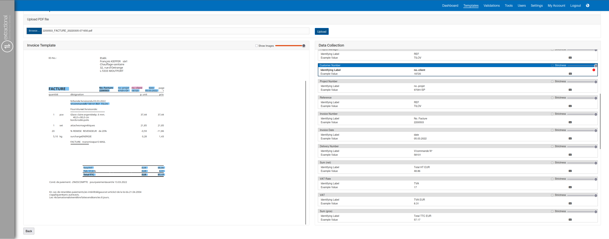

*Version: {{ page.meta.version }}*

  <a class="md-button print-button" href="../../pdfs/fr/System Overview-Template.pdf" target="_blank">
    Télécharger cette section au format PDF
  </a>

## Modèle

### Quel est le but principal

Sur cette page, l’utilisateur définit tous les différents modèles pour
tous les différents types de documents qu’il souhaite automatiser dans le
système pour la collecte de données.\
De plus, l’utilisateur a également la possibilité de gérer tous les modèles
actuellement créés.

### Prérequis

Avant de commencer à créer les différents modèles, il est recommandé de
définir toutes les données qui devront être collectées dans votre système.
To do so, you shall go into the application settings and define all the data that shall be collected in your system. You can find more information in the [the following section](Settings.md#analysis-fields).

En outre, il est également recommandé de définir le type d’utilisateur qui
a l’autorisation de créer ou de gérer l’application. Plus d’informations
dans [*ce*](Settings.md#user-roles) lien .

### Aperçu

{width="1000"}

### Aperçu des fonctionnalités

#### Ajouter un nouveau modèle

Dans cette partie, vous trouverez un guide étape par étape expliquant
comment ajouter un nouveau modèle à votre système.

<b>Tutoriel vidéo sur comment ajouter un nouveau modèle </b>

    <iframe src="https://www.youtube.com/embed/BHS_hmTIIxM?si=uQbaBNf9Nhew9ylP" allow="accelerometer; autoplay; clipboard-write; encrypted-media; gyroscope; picture-in-picture; web-share" referrerpolicy="strict-origin-when-cross-origin" allowfullscreen></iframe>

##### Déclencher le système 

Pour déclencher le système, il suffit de cliquer sur le bouton `"New
Template"`. Vous serez alors redirigé vers la page suivante :

{width="1000"}

##### Télécharger un fichier modèle 

À cette étape, vous allez télécharger un fichier modèle afin que le
système dispose d’une base. Pour ce faire, cliquez sur le bouton `"Browse
file"` en haut à gauche de l’écran. Après avoir cliqué sur ce bouton, vous
serez redirigé vers l’outil de sélection de fichiers de votre système
d’exploitation pour choisir le modèle souhaité.

Une fois le fichier sélectionné, cliquez sur le bouton `"Upload"`. Le
système téléversera alors le fichier et cela ressemblera à ceci :

{width="1000"}

##### Définir tous les différents champs 

Cette étape est la plus chronophage et également la plus importante. Vous
y définirez tous les champs nécessaires pour l’automatisation future.

Avant de commencer l’analyse du document, gardez à l’esprit que vous
pouvez toujours supprimer partiellement ou complètement toutes les images
d’un PDF. Pour ce faire, utilisez la case à cocher `"Show Images"` afin
d’afficher toutes les images du fichier. Vous pouvez ajuster la
visibilité à tout moment à l’aide de la barre de défilement située juste
après le champ `"Show Images"`.

!!! warning "Important" 
    Vous pouvez utiliser des images dans les différents champs comme
    valeurs, par exemple pour l’identification. Le système hachera l’image
    et enregistrera l’information hachée. Cependant, utiliser des images
    comme identifiants comporte le risque que le modèle ne soit pas reconnu
    même si l’image change d’un seul pixel. Nous recommandons donc
    d’utiliser des images comme identifiant uniquement en dernier recours.

Tout d’abord, vous devez définir tous les champs qui constitueront les
propriétés de base du modèle, comme le nom du modèle, la devise et le type
de document.

!!! warning "**Choisir un identifiant unique**"
    Ensuite, vous devez saisir le champ qui permettra d’identifier tout
    document pour déclencher l’utilisation de ce modèle. Nous recommandons
    toujours d’utiliser un texte ou une valeur qui sera toujours présent(e)
    dans ce type de document de l’entreprise ainsi qu’un identifiant du type
    de document (par exemple, le numéro de TVA de l’entreprise associé à
    l’indication qu’il s’agit d’une facture).  
    Pour sélectionner le(s) champ(s) à utiliser comme identifiant(s), vous
    devez d’abord cliquer dans la `"Supplier box"` puis cliquer sur le(s)
    champ(s) à utiliser comme identifiant(s) dans le document. Si vous
    souhaitez utiliser plusieurs identifiants, maintenez la touche `"Ctrl"`
    enfoncée et sélectionnez tous les champs.  
    Vous pouvez également utiliser des images comme identifiants de
    documents, mais cela doit être le dernier recours puisque les
    entreprises changent parfois l’apparence de leurs documents.

Il existe deux façons de définir l’automatisation des champs : l’insertion
automatique et l’insertion manuelle.  
Tous les champs automatisés sont ceux que le système identifiera dans
chaque facture, tandis que les champs manuels sont des constantes et
resteront toujours identiques dans tous les documents. Nous recommandons
de définir toutes les constantes comme champs manuels afin d’améliorer la
cohérence et l’efficacité du système.

Pour définir tous les champs automatisés et les identifiants
correspondants, vous devez utiliser la même technique que pour le champ
d’identification, mais cette fois une fois pour l’identifiant des données
et une autre pour la valeur des données. Pour les champs manuels, vous
devez d’abord cliquer sur le bouton du clavier puis insérer la valeur
correspondante dans le système. Vous pouvez taper la valeur manuellement
ou utiliser la même technique qu’auparavant.

!!! info "Astuce"
    **Comment définir de bons candidats pour les paires
    "identifiant"/"valeur" :**

    - La distance entre l’identifiant et la valeur n’affecte pas la
      performance de l’algorithme.
    - Vous devez vous assurer que l’identifiant sera toujours présent
      dans le document, même si cela implique d’utiliser un identifiant
      situé à une plus grande distance de la valeur réelle.
    - Sélectionnez toujours la valeur entière et non une partie de celle-ci
      (sauf dans la description des lignes d’articles).

À la fin, votre système devrait ressembler à ceci :

{width="1000"}

#### Importer et exporter des modèles

Si vous souhaitez importer les modèles actuels dans un autre système ou
les envoyer au support, vous devez utiliser cette fonctionnalité.

##### Exporter des modèles 

Pour exporter des modèles, il suffit de cliquer sur le bouton `"Export
Templates"` et le téléchargement du fichier zip démarrera automatiquement.
Ce fichier zip contiendra toutes les informations de tous les modèles créés
dans votre système.

##### Importer des modèles 

Pour importer des modèles, cliquez sur le bouton `"Import Template(s)"`
et choisissez le fichier zip contenant tous les modèles précédemment
exportés.

#### Boutons et fonctionnalités supplémentaires

Cette partie expliquera tous les boutons supplémentaires et leur
utilisation.

##### Bouton Modifier

{width="75" align=right}

Le bouton de modification permet de déclencher le système pour modifier un
modèle spécifique. Ce bouton est visible dans chaque modèle et se présente
sous la forme de l’icône suivante :

Une fois que vous avez cliqué sur ce bouton pour un modèle spécifique,
vous accédez à la page où vous pouvez modifier tous les champs de ce
modèle.

##### Bouton Supprimer

{width="75" align=right}

Le bouton de suppression permet de supprimer un modèle spécifique de votre
système. Ce bouton est également visible dans chaque modèle et se présente
sous la forme de l’icône suivante :

!!! warning "Important"
    Sachez que si un modèle est supprimé, les validations créées avec ce
    modèle **ne** perdront **pas** leurs données extraites. En effet, le
    modèle n’est utilisé que pendant le processus d’extraction, après quoi
    toutes les données sont stockées indépendamment.

##### Case à cocher Peppol activé 

Dans cette colonne du tableau, vous pouvez vérifier si un modèle extrait
ou non toutes les lignes d’articles du document.

Tous les modèles cochés extrairont les données d’en-tête ainsi que toutes
les lignes d’articles de ce type de document, tandis qu’un modèle non
activé pour Peppol n’extraira que les données d’en-tête du fichier
concerné.
