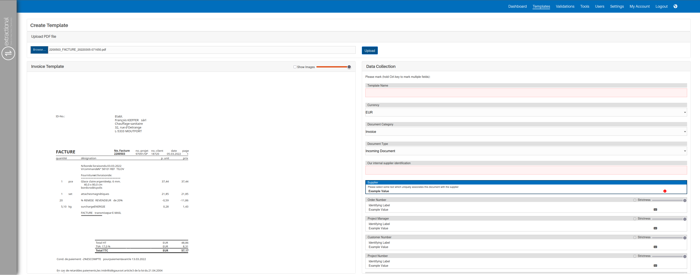

## Template

### What is this main purpose

In this page, the user will define all the different templates for all
the different types of documents that the user wants to automate in the
system for data collection.\
Furthermore, the user also has the possibility to manage all current
templates that have been created.

### Prerequisites

Before starting to create all the different templates, it is recommended
to define all the data that shall be collected in your system. To do so,
you shall go into the application settings and define all the data
collection in the Document section. You can find more information in the
\"Some link\" settings tab.\
In addition, it is also recommended to define the type of user who has
the permission to create or manage the application. More information in
the [*"this"*](#Settings_user_roles) link.

### Overview

{width="1000"}

### Functionalities overview

#### Adding a new template

In this part, you shall find a step-by-step guide on how to add a new
template to your system.

<b>Video tutorial on how to add a new template</b>

<iframe width="560" height="315" src="https://www.youtube.com/embed/BHS_hmTIIxM?si=uQbaBNf9Nhew9ylP" title="YouTube video player" frameborder="0" allow="accelerometer; autoplay; clipboard-write; encrypted-media; gyroscope; picture-in-picture; web-share" referrerpolicy="strict-origin-when-cross-origin" allowfullscreen></iframe>

##### Triggering the system 

To trigger the system, it is as simple as clicking on the `"New
Template"` button. You will then be redirected to the following page:

{width="1000"}

##### Uploading a template file 

During this part, you will upload a template file for the system to have
a base. You can do so by clicking the `"Browse file"` button in the top
left corner of the screen. After clicking on this button, you will be
redirected to the operating system's file selection tool to select the
desired template.

Once you have selected the file, you shall click on the `"Upload"`
button. The system will then upload the file and it will look something
like this:

{width="1000"}

##### Defining all the different fields 

This part of this process is the most time consuming and is also the
most important. During this part, you will define all the different
fields for future automation.

Before you start analysing the document, take into account that you can
always partially or completely remove all the pictures of a PDF. To do
this, use the checkbox `"Show Images"` to display all images in the
file. You can adjust the visibility at any time using the scrollbar
located directly after the `"Show Images"` field.

!!! warning "Important" 
    You can use images in the different fields as values, such as for
    identification. The system will hash the image and save the hashed
    information. However, using pictures as identifiers has the risk that
    the template will not be recognized even if the image has changed by as
    little as one pixel. Therefore, we recommend using pictures as
    identification as the last option.

First of all, you shall define all the fields that will define the base
properties of the template, such as template name, currency and document
type.

!!! warning "**Choosing a unique identifier**"
    After that, you shall enter the field that will identify any document
    to trigger this template to be used. We recommend always using a text or
    value that will always be present in this company's type of document as
    well as an identifier of what type of document it is (for example, using
    the tax number of the company together with the indication that it is an
    invoice). To select the field(s) that shall be used as identifiers, you
    shall first click into the `"Supplier box"` and then click on the
    field(s) that you would like to use as an identifier in the document. Be
    aware that if you want to use multiple identifiers, you shall use hold
    the `"Ctrl"` button and select all of the fields. Additionally, you can
    also use images as identifiers to documents, but it shall be used as the
    last option since companies do sometimes change their looks in their
    documents.

There are two ways to define field automation: automated and manual
insertion. All automated fields are the ones that the system shall
identify in each invoice while the manual ones are the ones that are
constants and will always be constant throughout all documents. We
recommend defining all constants as manual fields to improve the
consistency and efficiency of the system.

To define all the different automated fields and respective identifiers,
you shall use the same technique as the one for the identification field
but in this case, once for the data identification and the other for the
data value. As for the manual fields, you shall first click on the
keyboard button and then insert the respective value into the system.
You can manually type the value or use the same technique as before.

!!! info "Tip"
    **How to define good candidates for "identifier"/"value" pairs:**

    -   The distance from the identifier to the value will not interfere the
        performance of the algorithm

    -   You need to make sure that the identifier should always be present
        in the document, even if this requires using an identifier that is
        positioned within a larger distance from the actual value.

    -   Always select the whole value and not part of it (apart from the
        description in line items).

In the end, your system shall look something like this:

{width="1000"}

#### Importing and exporting templates

If you would like to import the current templates to another system or
send them to the support, you shall use this functionality.

##### Exporting Templates 

To export templates, you only need to click on the `"Export Templates"`
button and the download of the zip file will start automatically. This
zip file will contain all the information of all templates that have
been created in your system.

##### Importing Templates 

To import templates, you shall click on the `"Import Template(s)"`
button and choose the zip file containing all the templates previously
exported.

#### Additional buttons and functionalities

This part will consist of explaining all the additional buttons and how
to use them.

##### Edit button

{width="75" align=right}

The edit button is responsible for triggering the system to edit a
specific template. This button can be seen in each template and is
visualized as the following icon:

Once you click on the following button for a specific template, you will
enter the page where you can modify all the different fields in that
template.

##### Delete button

{width="75" align=right}

The deletion button is responsible for deleting a specific template from
your system. This button can also be seen in each template and is
visualized as the following icon:

!!! warning "Important"
    Be aware that if a template is deleted, validations created with it will
    **not** lose their extracted data. This is because the template is only
    used during the extraction process, after which all data is stored
    independently.

##### Peppol Enabled Checkbox 

In this column of the table, you will be able to click understand if a
certain template does extract all Line items of the document or not.

All checked templates will extract the envelope data and all line items
of this type of document while one that is not Peppol enabled will only
extract the envelope data of the respective file.