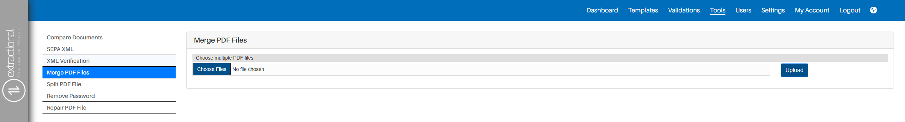

*Version: {{ page.meta.version }}*

  <a class="md-button print-button" href="../../pdfs/de/System Overview-Tools.pdf" target="_blank">
    Diesen Abschnitt als PDF herunterladen
  </a>

# Werkzeuge

## Was ist der Hauptzweck dieser Seite

Auf dieser Seite finden Sie alle zusätzlichen Seiten, die unser System
anbietet. Alle diese Werkzeuge wurden entwickelt, um Unternehmen bei der Verbesserung
ihrer Arbeitsabläufe zu unterstützen.

Die zusätzlichen Werkzeuge, die Sie in unserem System finden können, sind die folgenden:

-   Werkzeug zum Dokumentenvergleich
-   Erstellung von SEPA-XML-Transaktionen
-   Werkzeug zum Zusammenführen von PDFs
-   Werkzeug zum Aufteilen von PDFs
-   Werkzeug zum Entfernen von PDF-Passwörtern
-   Werkzeug zur Reparatur von PDFs

Wir erklären auf den folgenden Seiten, was jedes Werkzeug macht und wie es
verwendet wird. Bitte beachten Sie, dass einige Werkzeuge völlig unabhängig
vom Rest des Systems funktionieren.

<h2>Video-Tutorials</h2>

Das folgende Video gibt eine ausführliche Erklärung, wie alle <b>PDF-bezogenen Werkzeuge</b> funktionieren. 

<iframe src="https://www.youtube.com/embed/EK_Xz3HMQVc?si=CvtiU0tkcJNEol1v" frameborder="0" allow="accelerometer; autoplay; clipboard-write; encrypted-media; gyroscope; picture-in-picture; web-share" referrerpolicy="strict-origin-when-cross-origin" allowfullscreen></iframe>

Das folgende Video gibt eine ausführliche Erklärung, wie alle <b>Peppol-bezogenen Werkzeuge</b> funktionieren. 

<iframe src="https://www.youtube.com/embed/vcxxKoZMu04?si=lH__kUp4QM5kL_jy" frameborder="0" allow="accelerometer; autoplay; clipboard-write; encrypted-media; gyroscope; picture-in-picture; web-share" referrerpolicy="strict-origin-when-cross-origin" allowfullscreen></iframe>

---

## Dokumentenvergleich

Dieses Werkzeug ermöglicht es, Dokumente im System zu vergleichen.
Es überprüft die Unterschiede zwischen zwei Dokumenten basierend
auf den Kriterien, die Sie im System angegeben haben.

### Verwendung

Zunächst müssen Sie das Werkzeug im System aktivieren.  
Klicken Sie dazu auf `Dokumente vergleichen` im linken Menü.  
Ihr Bildschirm sollte dann wie folgt aussehen:

{width="1000"}

### Eine einfache Vergleichsausführung

**Was ist ein einfacher Vergleich?**

Ein einfacher Vergleich bedeutet, dass Sie nur ein Argument pro Dokument auswählen.  
Das System sucht dann im linken Dokument nach dem gewählten Argument und prüft,
ob derselbe Wert in einem Element des rechten Dokuments vorhanden ist.

**Wie geht das?**

Um einen einfachen Vergleich zwischen zwei oder mehreren Dokumenten durchzuführen,  
wählen Sie jeweils eine Datei, legen Sie das Vergleichskriterium fest und klicken Sie
auf den Button `Absenden`. Das System zeigt Ihnen anschließend die Unterschiede an.

!!! note
    Sie haben die Möglichkeit, auf der linken Seite mehrere Dokumente auszuwählen, um diese mit einem einzigen Dokument rechts zu vergleichen.

### Mehrbedingter Vergleich

**Was ist ein mehrbedingter Vergleich?**

Ein mehrbedingter Vergleich erlaubt es Ihnen, ein Identifikationsargument
sowie ein oder mehrere Vergleichsargumente zu definieren.  
Das System sucht in jedem Dokument nach einem Element mit demselben
Identifikationsargument und vergleicht dann die weiteren angegebenen Argumente.  
Falls keine Übereinstimmung gefunden wird, wird kein Vergleich ausgeführt.

**Wie wird er ausgeführt?**

Definieren Sie zunächst das Identifikationsargument auf beiden Seiten,  
wie bei einem einfachen Vergleich.  
Fügen Sie dann alle gewünschten Vergleichsargumente hinzu, indem Sie auf das grüne Plus-Symbol klicken.  
Zum Schluss klicken Sie auf `Absenden`, und das System führt den Vergleich durch.

!!! note
    Alle Elemente ohne entsprechendes Gegenstück erscheinen in Rot,  
    alle übrigen in Grün.  
    Unterschiedliche Vergleichselemente innerhalb desselben Identifikationsarguments werden nicht rot markiert.

{width=1000}

### Zusätzliche Schaltflächen

Sie können auch direkt den Status des verglichenen Dokuments ändern,  
indem Sie unten links im jeweiligen Tabellenbereich auf `Freigeben` klicken.

---

## SEPA XML

Dieses Werkzeug erstellt automatisch XML-Dateien mit allen SEPA-Transaktionen,  
die für die Abwicklung der ausgewählten Validierungen erforderlich sind.

### Voraussetzungen

Ihr(e) Konto/Konten müssen im System konfiguriert sein (siehe [Einstellungen](Settings.md#company-data)).  
Außerdem können XML-Dateien nur für bereits freigegebene Validierungen erzeugt werden.

### Funktionsweise

Klicken Sie auf `SEPA XML` im linken Menü. Ihr Bildschirm sollte wie folgt aussehen:

{width="1000"}

Wählen Sie nun die gewünschten Validierungen, indem Sie die Kontrollkästchen anklicken:

{width="750"}

Anschließend wählen Sie das gewünschte Bankkonto sowie die Sprache aus.  
Klicken Sie danach auf `Absenden`, und die XML-Datei(en) wird/werden heruntergeladen.

---

## XML-Verifizierung

Mit diesem Werkzeug können Sie überprüfen, ob XML-Dateien (SEPA oder PEPPOL) syntaktisch korrekt sind.

### Verwendung

Klicken Sie auf `XML-Verifizierung` im linken Menü.  
Sie sehen die folgende Seite:

{width="1000"}

Wählen Sie die gewünschte Verifizierungsart (SEPA oder PEPPOL) sowie ggf. zusätzliche Parameter.  
Klicken Sie anschließend auf `Datei auswählen`, um die zu prüfende Datei hochzuladen.  
Mit `Absenden` startet die Überprüfung. Das Ergebnis wird Ihnen direkt angezeigt.

---

## PDF-Bearbeitung

Unser System bietet verschiedene Werkzeuge zur Bearbeitung von PDFs,  
die Ihnen die Verwaltung erleichtern.

### PDF-Dateien zusammenführen

Dieses Werkzeug erlaubt es, mehrere PDF-Dateien zu einer einzigen zusammenzuführen.

#### Verwendung

Klicken Sie auf `PDF-Dateien zusammenführen`. Sie sehen dann folgendes Fenster:

{width="1000"}

Wählen Sie Ihre Dateien über `Dateien auswählen` aus und klicken Sie anschließend auf `Hochladen`.  
Danach können Sie die Reihenfolge der Dateien per Drag-and-Drop festlegen, bevor Sie auf `Absenden` klicken.

!!! warning "Wichtig"
    Wir empfehlen, alle Dateien vorab im selben Ordner abzulegen, um die Auswahl zu erleichtern.

{width="1000"}

---

### PDF-Dateien aufteilen

Dieses Werkzeug teilt eine PDF-Datei in mehrere Dateien auf, eine pro Seite.

!!! warning "Wichtig"
    Sie können dieses Werkzeug auch zusammen mit dem Zusammenführen nutzen,  
    um komplexere Operationen durchzuführen.

#### Verwendung

Klicken Sie auf `PDF-Datei aufteilen`.  
Wählen Sie eine Datei aus und klicken Sie auf `Hochladen`.  
Das System erstellt automatisch eine ZIP-Datei mit den einzelnen PDFs.

{width="1000"}

---

### Passwort entfernen

Mit diesem Werkzeug können Sie das Passwort eines PDFs dauerhaft entfernen –  
aber nur, wenn Sie das aktuelle Passwort kennen.

#### Verwendung

Klicken Sie auf `Passwort entfernen`. Wählen Sie eine Datei aus, geben Sie das aktuelle Passwort ein  
und klicken Sie auf `Hochladen`.  
Falls erfolgreich, wird die PDF-Datei ohne Passwort heruntergeladen.

{width="1000"}

---

### Datei reparieren

Dieses Werkzeug hilft Ihnen, leicht beschädigte PDF-Dateien wiederherzustellen.

!!! warning "Wichtig"
    Es können nur leicht beschädigte Dateien repariert werden, nicht schwer beschädigte.

#### Verwendung

Klicken Sie auf `PDF-Datei reparieren`.  
Wählen Sie die Datei aus und klicken Sie auf `Hochladen`.  
Falls die Reparatur gelingt, wird die Datei direkt heruntergeladen.  
Falls nicht, zeigt das System eine Fehlermeldung an.

{width="1000"}
