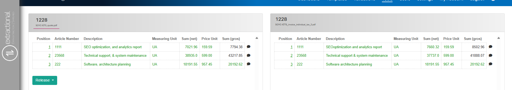
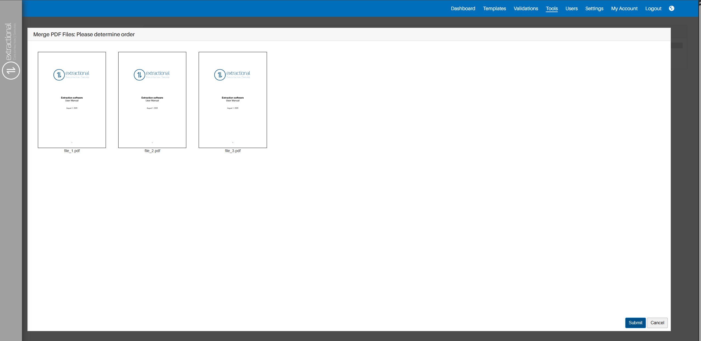

*Version: {{ page.meta.version }}*

# Tools

## What is the main Purpose of this Page

In this page will will find all the additional pages that our system
offers. All of these tools have been developed to help companies improve
their workflow.

The additional tools that you can find in our system are the following:

-   Document comparison tool

-   SEPA XML transactions generation

-   Merging pdf's tool

-   Splitting pdf's tool

-   Removing pdf's password tool

-   Repairing pdf's tool

We will explain, in the following pages, what each toll does and how to
use it. Please take in consideration that some tools work completely in
parallel to the rest of the system.

<h2>Video tutorials</h2>

The following video gives a thorough explanation on how all the <b>pdf related tools</b> work. 

<iframe src="https://www.youtube.com/embed/EK_Xz3HMQVc?si=CvtiU0tkcJNEol1v" frameborder="0" allow="accelerometer; autoplay; clipboard-write; encrypted-media; gyroscope; picture-in-picture; web-share" referrerpolicy="strict-origin-when-cross-origin" allowfullscreen></iframe>

The following video gives a thorough explanation on how all the <b>Peppol related tools</b> work. 

<iframe src="https://www.youtube.com/embed/vcxxKoZMu04?si=lH__kUp4QM5kL_jy" frameborder="0" allow="accelerometer; autoplay; clipboard-write; encrypted-media; gyroscope; picture-in-picture; web-share" referrerpolicy="strict-origin-when-cross-origin" allowfullscreen></iframe>

---

## Document comparison Tool

This tool, as the name suggests, allows one to compare current documents
that are currently in the system. It will verify what are the difference
between both documents depending on the criteria(s) that you shall insert
in the system.

### How to use it

First of all, you will to trigger the system that you want to use that
specific tool. To do so, you will need to click on the `Compare
Documents` that can be found on the left side of the screen. Once you
have triggered the system, your system should look like this:

{width="1000"}

### Executing a simple comparison

**What is a simple comparison**

A simple comparison in our system is when you simply choose one Argument for each document for comparison.
The system, in this case, will simply look for all the chosen argument in each document in the left and try to find the same value in one of the items of the selected at the right side.

**How to do it**

To do a simple comparison between two or more documents,you will only need to
click choose on file at each side window, choose the comparison
criterion, and click on the `Submit` button to let the system
visualize the differences between both documents.

!!! note
    Please note that you have the possibility to choose several documents at the left side of tool, allowing to compare several documents into a single one.

### Executing a multi-conditional comparison

**What is a multi-conditional comparison in our system**

A multi-conditional comparison in our system allows you to define a identifier argument to a comparison and one or several arguments as comparative ones.

In this case, the system will try to find an item within each document with the same identifier argument and compare the other arguments defined. If the system fails to do to find two items with the same identity argument,, it will not execute any comparison.

**How to execute this type of comparison**

In order to trigger the system to create such a comparison, you will firstly need to define the identity argument for each one of the sides as if you where to do a simple comparison.

You will then add all of your comparison arguments by clicking on the small green plus icon that can be found at the top right corner of the left argument case.

Once done, you will need to define the argument that you want to compare in both sides. You can add as many comparative arguments as you would like.

Once you have made your choice, you will simply need to click on the `Submit` button at the system will execute the comparison.

!!! note
    All items that do not have a respective item to compare will appear in red while all the other will appear in green.
    In addition, all comparative elements that will not be equal within the same identity elements will not appear in red.

Here you may also find a screenshot of how the system will look like when comparing elements from two documents:

{width=1000}

### Additional buttons

Additionally, you also have the possibility to directly change the state o of teh document that is being compared. This can be done by clicking on the `Release` button on the bottom left corner of the respective table.

---

## SEPA XML

This tool will automatically generate all xml files containing all SEPA
transactions needed to liquidate all selected validations.

### Prerequisites

In order to use this tool, you account(s) will needs to already be
configured in the system. This can be done in the settings page. For
more information, please follow the following [link](Settings.md#company-data)

In addition, you will only be able to generate XML files for validations
that have been released, this ensuring that you do not pay any documents
that have not been verified be someone.

### How it works

Initially, you will need to click on the `SEPA XML` text field at the
left side of the screen. Once you have selected the correct tool, your
system shall look like this:

{width="1000"}

Now that you are on the correct tool, you will need to choose all the
validations that you would like to create their respective XML files. To
do so, you will need to select them by clicking on the square box
situated at the left of each validation. To help you visualize where you
shall select the different files, here is an example in which only the
first file is selected:

{width="750"}

Once you have selected all the desired files, you will need to choose
the desired bank account where you would like to execute the several
payments, as well as choosing the respective language that you would
like to be present on the respective XML files.

To choose all of these parameters, you can click on each selection at
the bottom of the page and select your preference.

Lastly, once all of the preferences have been chosen, you shall now
click on the `Submit` button, and the corresponding XML file(s) will
be downloaded.

---

## XML Verification

In this tool you will be able to verify if any XML files (SEPA or
PEPPOL) are syntactically correct.

### How to use this tool

To use this tool, you will to need to start by clicking on the \"XML
Verification\" text field on the left side of the screen. Once you have
clicked on the respective button, you shall be presented with the
following page:

{width="1000"}

You will then choose the type of verification that you would like to
perform (typically SEPA or PEPPOL) and, if needed, choose all the
respective additional parameters.

Once you have defined all the different parameters, you shall now choose
the file that you would like to verify, this can be done by clicking on
the `Choose file` button. You will be redirected to your operating
system's file-selection dialog to then select the corresponding file.

After making your choice, you can now verify your XML file by simply
clicking on the `Submit` button. The system will then verify the
chosen file and will now directly tell you if there are any errors in
the file.

---

## PDF Manipulation

Our system also provides different pdf manipulation tools. All of these
tool will allow you to help you manage all pdf files easily.

### Merging pdf files

This tool allows you to merge several pdf file into one file.

#### How to use this tool 

To use this tool, you will need to firstly click on the `Merge PDF
Files` text field on the left side of the screen. You will then be
presented with the following screen:

{width="1000"}

Now that you are in this menu, you will then need to choose all the
files that you would like to merge. This will be done by clicking on the
`Choose files` button followed by using your operating system's
file-selection dialogue to select all the files.

!!! warning "Important"
    We recommend having all files that you would like to merge in the same
    directory (folder) to facilitate the selection of the files in the
    operating system's file-selection dialogue.

After having done the file section, you will then need to upload all the
files into the system; this can be done by clicking on the `Upload`
button on the right side of the screen.

The system will then redirect you a new page where you will have the
possibility to reorder all the files that you are going to merge. In
order to reorder them you will need to drag them around. This reordering
page shall look like this:

{width="1000"}

As soon as you are happy with the order, you can now click on the
`Submit` button and the merged file will be downloaded in your
machine.

### Splitting PDF's

This tool will allow you to do the vice-versa of the previous one,
meaning that it will split a pdf file into several pdf files. More
specifically, this system will separate a X-paged pdf file into x files,
each one containing of the pages of the file.

!!! warning "Important"
    You can always use this tool together with the `Merge PDF Files` toll
    to execute a more sophisticated operation.

#### How to use this tool 

To use this tool, you will need to first click on the `Split PDF File`
text field on the left side of the screen. You will then be presented
with the following screen:

{width="1000"}

Afterward, choose the file that you would like to split by clicking on
the `Choose files` button followed by using your operating system's
file-selection dialog to select the file.

After having done the file section, you will then need to upload all the
files to the system; this can be done by clicking on the `Upload`
button on the right side of the screen. The system will then
automatically download all the different files in your machine. Please
be aware that all files will be downloaded in a compressed format zip
file.

### Removing Password

This tool will allow one to remove a password of a certain PDF
permanently; this, however, can only be done if you have the current
password at your disposal.

#### How to use this tool 

To use this tool, you will need to first click on the `Remove Password` text field on the left side of the screen. You will then be
presented with the following screen:

{width="1000"}

Afterward, choose the file that you would like to split by clicking on
the `Choose files` button followed by using your operating system's
file-selection dialog to select the file.

Once you have chosen the file that you would like to remove it's
password, you will need to insert the current PDF's password by
inserting it in the text field under *Current Password* and click the
`Upload button` on the right side of the screen.

The system will then try to remove the pdf's password and if it
succeeds, it will directly download the pdf without any password; if not
a pop-up message will be shown telling you what went wrong.

### Repair file

This tool will help you recover any corrupted pdf file that might have suffered any lightly damages.

!!! warning "Important"
    Please note that this tool will only recover files that have suffered
    slight damages; it will not be able to recover from more severe damages.

#### How to use this tool 

To use this tool, you will need to first click on the `Repair PDF
File` text field on the left side of the screen. You will then be
presented with the following screen:

{width="1000"}

Afterward, choose the file that you would like to repair by clicking on
the `Choose file` button followed by using your operating system's
file-selection dialog to select the file.

After having done the file section, you will then need to upload the
file to the system; this can be done by clicking on the \"Upload\"
button on the right side of the screen. The system will then
automatically try to repair the uploaded pdf, and, if it succeeds, it
will directly download the recovered file; if it does not succeed, a
pop-up message will be shown telling you what went wrong.
