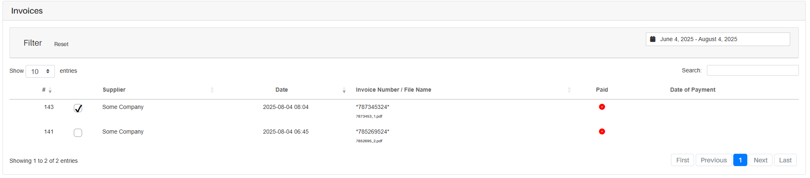

*Version: {{ page.meta.version }}*

  <a class="md-button print-button" href="../../pdfs/fr/System Overview-Tools.pdf" target="_blank">
    Télécharger cette section au format PDF
  </a>

# Outils

## Quel est le but principal de cette page

Dans cette page, vous trouverez toutes les pages supplémentaires que notre système
propose. Tous ces outils ont été développés pour aider les entreprises à améliorer
leur flux de travail.

Les outils supplémentaires que vous pouvez trouver dans notre système sont les suivants :

-   Outil de comparaison de documents
-   Génération de transactions SEPA en XML
-   Outil de fusion de PDF
-   Outil de séparation de PDF
-   Outil de suppression de mot de passe PDF
-   Outil de réparation de PDF

Nous expliquerons, dans les pages suivantes, ce que chaque outil fait et comment
l’utiliser. Veuillez prendre en considération que certains outils fonctionnent
complètement en parallèle au reste du système.

<h2>Tutoriels vidéo</h2>

La vidéo suivante donne une explication complète sur le fonctionnement de tous les <b>outils liés aux PDF</b>. 

<iframe src="https://www.youtube.com/embed/EK_Xz3HMQVc?si=CvtiU0tkcJNEol1v" frameborder="0" allow="accelerometer; autoplay; clipboard-write; encrypted-media; gyroscope; picture-in-picture; web-share" referrerpolicy="strict-origin-when-cross-origin" allowfullscreen></iframe>

La vidéo suivante donne une explication complète sur le fonctionnement de tous les <b>outils liés à Peppol</b>. 

<iframe src="https://www.youtube.com/embed/vcxxKoZMu04?si=lH__kUp4QM5kL_jy" frameborder="0" allow="accelerometer; autoplay; clipboard-write; encrypted-media; gyroscope; picture-in-picture; web-share" referrerpolicy="strict-origin-when-cross-origin" allowfullscreen></iframe>

---

## Outil de comparaison de documents

Cet outil, comme son nom l’indique, permet de comparer les documents
qui sont actuellement dans le système. Il vérifie les différences entre deux documents
en fonction du ou des critères que vous avez insérés dans le système.

### Comment l’utiliser

Tout d’abord, vous devez communiquer au système que vous souhaitez utiliser avec cet outil.
Pour cela, cliquez sur `Comparer les documents` dans le menu de gauche. Une fois activé,
votre écran devrait ressembler à ceci :

{width="1000"}

### Exécuter une comparaison simple

**Qu’est-ce qu’une comparaison simple ?**

Une comparaison simple consiste à choisir un seul argument pour chaque document.  
Le système recherche alors l’argument choisi dans chaque document de gauche et tente
de trouver la même valeur dans l’un des éléments du document sélectionné à droite.

**Comment faire ?**

Pour effectuer une comparaison simple entre deux ou plusieurs documents, il suffit de
choisir un fichier de chaque côté, définir le critère de comparaison, et cliquer sur
le bouton `Soumettre`. Le système affichera les différences entre les documents.

!!! note
    Vous avez la possibilité de choisir plusieurs documents du côté gauche, afin de comparer plusieurs documents avec un seul document de droite.

### Exécuter une comparaison multi-conditionnelle

**Qu’est-ce qu’une comparaison multi-conditionnelle ?**

Une comparaison multi-conditionnelle vous permet de définir un argument identifiant
et un ou plusieurs arguments comparatifs.  
Le système essaiera de trouver un élément dans chaque document avec le même identifiant
et comparera ensuite les autres arguments définis. Si aucun élément avec le même identifiant
n’est trouvé, la comparaison ne sera pas effectuée.

**Comment l’exécuter ?**

Commencez par définir l’argument identifiant de chaque côté, comme pour une comparaison simple.  
Ensuite, ajoutez tous vos arguments comparatifs en cliquant sur l’icône verte en haut à droite.  
Enfin, cliquez sur `Soumettre` et le système exécutera la comparaison.

!!! note
    Tous les éléments sans équivalent apparaîtront en rouge,  
    tandis que les autres apparaîtront en vert.  
    Les éléments comparatifs différents dans le même identifiant ne seront pas marqués en rouge.

{width=1000}

### Boutons supplémentaires

Vous pouvez également modifier directement l’état du document en cliquant sur le bouton
`Publier` situé en bas à gauche du tableau.

---

## SEPA XML

Cet outil génère automatiquement des fichiers XML contenant toutes les transactions SEPA
nécessaires pour liquider les validations sélectionnées.

### Prérequis

Votre (vos) compte(s) doivent être configurés dans le système (voir [Paramètres](Settings.md#company-data)).  
De plus, vous ne pouvez générer des fichiers XML que pour des validations déjà publiées.

### Fonctionnement

Cliquez sur `SEPA XML` dans le menu de gauche. Votre écran ressemblera à ceci :

{width="1000"}

Sélectionnez les validations que vous souhaitez inclure en cochant les cases. Exemple :

{width="750"}

Choisissez ensuite le compte bancaire et la langue, puis cliquez sur `Soumettre`.  
Le(s) fichier(s) XML correspondant(s) seront téléchargés.

---

## Vérification XML

Cet outil vous permet de vérifier si un fichier XML (SEPA ou PEPPOL) est syntaxiquement correct.

### Comment l’utiliser

Cliquez sur `Vérification XML` dans le menu de gauche. Vous verrez la page suivante :

{width="1000"}

Choisissez le type de vérification (SEPA ou PEPPOL), sélectionnez les paramètres nécessaires,
puis importez votre fichier en cliquant sur `Choisir un fichier`.  
Enfin, cliquez sur `Soumettre` pour lancer la vérification.

---

## Manipulation de PDF

Notre système propose plusieurs outils de manipulation de PDF pour faciliter leur gestion.

### Fusion de fichiers PDF

Cet outil permet de fusionner plusieurs fichiers PDF en un seul.

#### Comment l’utiliser 

Cliquez sur `Fusionner les fichiers PDF`. Vous verrez l’écran suivant :

{width="1000"}

Sélectionnez vos fichiers en cliquant sur `Choisir les fichiers`, puis `Téléverser`.  
Ensuite, réorganisez vos fichiers par glisser-déposer avant de cliquer sur `Soumettre`.

!!! warning "Important"
    Nous vous recommandons de placer tous les fichiers dans le même dossier avant de les sélectionner.

{width="1000"}

---

### Diviser un PDF

Cet outil permet de diviser un fichier PDF en plusieurs fichiers, un par page.

!!! warning "Important"
    Vous pouvez combiner cet outil avec la fusion pour réaliser des opérations plus avancées.

#### Comment l’utiliser 

Cliquez sur `Diviser le fichier PDF`.  
Sélectionnez un fichier, puis cliquez sur `Téléverser`.  
Le système téléchargera un fichier ZIP contenant les PDF découpés.

{width="1000"}

---

### Suppression de mot de passe

Cet outil permet de supprimer définitivement le mot de passe d’un PDF,  
mais uniquement si vous connaissez le mot de passe actuel.

#### Comment l’utiliser 

Cliquez sur `Supprimer le mot de passe`. Sélectionnez le fichier, saisissez le mot de passe actuel,
puis cliquez sur `Télécharger`. Si l’opération réussit, le PDF sera téléchargé sans mot de passe.

{width="1000"}

---

### Réparer un fichier

Cet outil permet de récupérer un PDF légèrement endommagé.

!!! warning "Important"
    Seuls les fichiers légèrement corrompus peuvent être réparés, pas les dommages sévères.

#### Comment l’utiliser 

Cliquez sur `Réparer un fichier PDF`. Sélectionnez le fichier, puis cliquez sur `Télécharger`.  
Si la réparation réussit, le fichier corrigé sera téléchargé. Sinon, un message d’erreur s’affichera.

{width="1000"}
