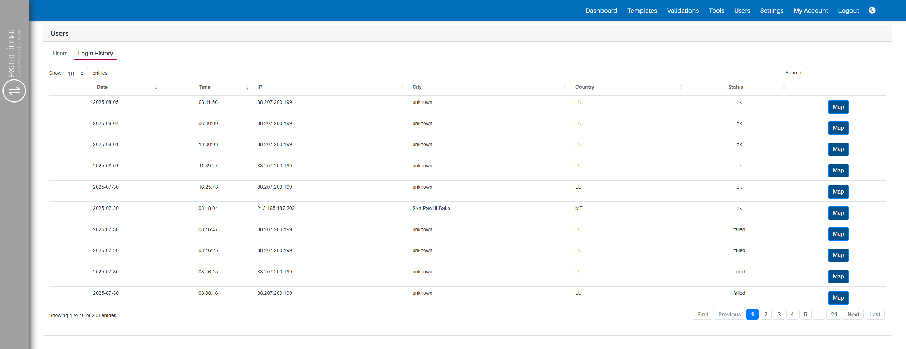

*Version: {{ page.meta.version }}*

# Utilisateurs

## Quel est l’objectif principal

Dans cette page, vous pourrez contrôler et surveiller tous les
utilisateurs ayant accès à votre système et à vos données.  
C’est également ici que vous pourrez ajouter ou supprimer des utilisateurs
de votre système.

## Prérequis

Avant de commencer à gérer ou à ajouter des utilisateurs à votre système,
nous vous recommandons de définir tous les rôles existants ainsi que
les droits associés à chaque type d’utilisateur.

## Aperçu

{width="1000"}

<h2>Tutoriel vidéo</h2>

<iframe src="https://www.youtube.com/embed/wantwfXFLYc?si=bkxPJGAFK2s_ZJZw" frameborder="0" allow="accelerometer; autoplay; clipboard-write; encrypted-media; gyroscope; picture-in-picture; web-share" referrerpolicy="strict-origin-when-cross-origin" allowfullscreen></iframe>

## Guide Administrateur

Dans cette section, vous trouverez toutes les informations techniques et critiques concernant la gestion des utilisateurs de notre système.

**Importance du nom d’utilisateur et de l’adresse e-mail**

Extractional accorde une grande importance au nom d’utilisateur et
surtout à l’adresse e-mail.  
Dans notre système, chaque adresse e-mail doit être unique pour chaque utilisateur.  
Assurez-vous donc que chaque e-mail ne soit utilisé qu’une seule fois
pendant toute la durée de vie du logiciel.  
Cette durée de vie inclut également les **utilisateurs supprimés**.

**Comment notre système gère les utilisateurs supprimés**

Dans notre système, nous ne supprimons jamais complètement un utilisateur.  
La raison est de conserver les enregistrements de toutes les validations traitées par chaque utilisateur.

En gardant toujours les informations de l’utilisateur, vous pourrez identifier
la personne assignée à chaque validation.

!!! warning "Important"
    Nous recommandons de ne mettre l’utilisateur qu’en `inactif` si vous n’êtes
    pas encore certain de devoir le réutiliser.  
    Tous les utilisateurs `inactifs` ne pourront pas entrer dans le système.

## Caractéristiques des utilisateurs

Il existe deux types principaux de caractéristiques utilisateur :  
celles servant uniquement à identifier l’utilisateur et celles qui définissent
ses droits d’accès et d’utilisation du système.

Ici, nous ne nous concentrerons que sur les caractéristiques
ayant un impact sur l’utilisation du système.

#### Statut 

Indique l’état actuel du compte ou de la session d’un utilisateur.  
Notre système prévoit les statuts suivants :

-   `Actif` Le compte est pleinement fonctionnel et a accès à toutes les fonctionnalités.
-   `Inactif` Le compte est désactivé. L’utilisateur ne peut pas se connecter tant qu’il n’est pas réactivé.
-   `Confirmer le mot de passe` L’utilisateur doit confirmer ou réinitialiser son mot de passe avant d’accéder au système.
-   `Paiement requis` Le compte est restreint temporairement jusqu’au règlement des paiements en attente.

Selon le statut, l’utilisateur pourra ou non accéder au système.  
De plus, le système peut modifier automatiquement le statut.  
Avec les droits nécessaires, vous pouvez également changer un utilisateur **ACTIF**
en **INACTIF** pour lui retirer l’accès.

#### Rôle

Le rôle définit ce que l’utilisateur peut manipuler/visualiser dans le système.  
Notre système comporte quatre rôles prédéfinis : Superutilisateur, Admin, Créateur et Validateur.  
Vous pouvez toutefois créer de nouveaux rôles et définir leurs droits spécifiques.  
Plus d’informations sur la définition des rôles sont disponibles dans la documentation associée.

## Aperçu des principales fonctionnalités

Dans cette section, vous trouverez une explication sur l’utilisation de chaque fonctionnalité de cette page.

!!! warning "Important"
    Veuillez noter que seuls les utilisateurs disposant des droits adéquats
    peuvent créer ou modifier des utilisateurs.

### Ajouter un nouveau utilisateur dans le système

Pour ajouter un utilisateur, allez d’abord sur la page principale des utilisateurs.  
Si vous n’y êtes pas, cliquez sur le champ `Utilisateurs` dans la barre de navigation,  
puis à nouveau sur `Utilisateurs`.

Sur la bonne page, cliquez sur l’icône plus en bas de la page pour déclencher l’ajout.  
Voici à quoi ressemble cette icône :

{width="75"}

Vous serez redirigé vers un formulaire à remplir avec les informations du nouvel utilisateur.  
Une fois complété, cliquez sur `Soumettre` au bas de la page.  
Un lien d’invitation sera envoyé à l’adresse e-mail du nouvel utilisateur.

#### Accepter l’invitation 

**FONCTIONNALITÉ ENCORE EN TEST, actuellement aucune invitation n’est envoyée**

### Modifier les informations d’un utilisateur

Trouvez l’utilisateur concerné et cliquez sur l’icône d’édition :

{width="75"}

Vous accéderez alors au formulaire de modification contenant toutes ses informations.  
Vous pouvez changer manuellement ou sélectionner une option (selon le champ).  
Pour enregistrer, cliquez sur `Soumettre`.  
Pour annuler, utilisez le bouton retour en bas de la page.

### Supprimer un utilisateur

!!! warning "Important"
    Attention, une suppression est définitive !  
    Si vous souhaitez simplement retirer l’accès d’un utilisateur sans supprimer ses données,  
    il est préférable de changer son **Statut**.

Pour supprimer un utilisateur, cliquez sur l’icône de suppression présente à côté de son profil et confirmez.  
L’icône ressemble à :

{width="75"}

### Consulter l’historique de connexion des utilisateurs

Vous pouvez également consulter l’historique des connexions afin de vérifier les accès au système.  
Cliquez sur l’onglet `Historique des connexions` en haut de la page principale des utilisateurs.  

{width="350"}

Vous accéderez à une page affichant l’historique complet, comme ci-dessous :

{width="1000"}

Cette page montre toutes les tentatives de connexion ainsi que des informations supplémentaires
(ville, pays, statut, etc.).
