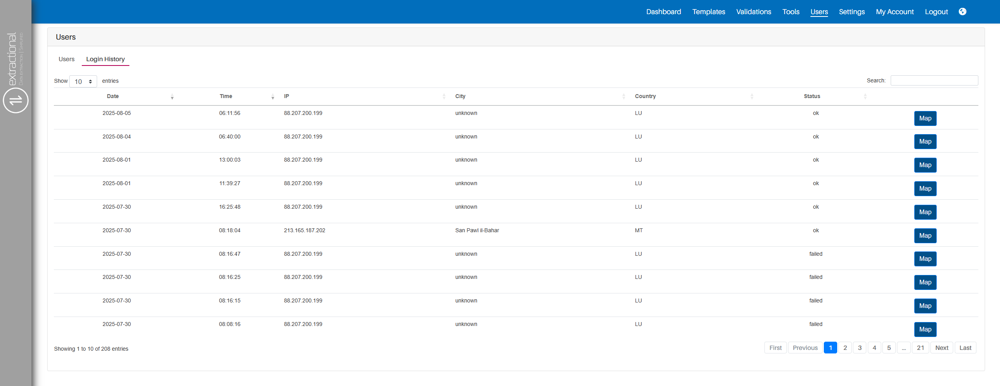

# Users

## What is the main Purpose

Inside this page, you will be able to control and monitor all users that
do have access to your system and data. Additionally, it is also here
where you can add and remove users to your system.

## Prerequisites

Before starting managing or adding any users to your system, we
recommend that you define all the different roles in your system, as
well as defining all the rights that each type of user shall have.

## Overview

{width="1000"}

<h2>Video Tutorial</h2>

<iframe src="https://www.youtube.com/embed/wantwfXFLYc?si=bkxPJGAFK2s_ZJZw" frameborder="0" allow="accelerometer; autoplay; clipboard-write; encrypted-media; gyroscope; picture-in-picture; web-share" referrerpolicy="strict-origin-when-cross-origin" allowfullscreen></iframe>

## Administrator Guide

In this section, you will find all the technical and critical information concerning the user management of our system.

**User name and email importance**

Extractional gives a lot of importance to teh username and specially to the user's email.
For our system, the email needs to be unique for each one of the users, so always make sure that each email is only used once during the lifetime of the software.
The lifetime of the software also includes **deleted users**.

**How our system deals with deleted users**

In our system, we do not completly remove any user. The reason behind this is to keep the records from all validations that each user has handled.

By always keeping the user's information, you will always be able to identify each validation's assigned person.

!!! warning "Important"
    We do recommend to only set the user to `inactive` if you are still not certain if you will need to reuse user in the future. All `inactive` users will not be able to enter the system.

## User Characteristics

There are two main types of user characteristics. There are
characteristics that will only serve to identify the user, and there are
characteristics that will also define if the user has permission to use
the system and what their permissions are in the system.

During the following paragraphs, we will only focus on the
characteristics that affect how the user will be able to use the system.

#### Status 

Indicates the current state of a user's account or session within the
system. Our system provides the following options for state:

-   `Active` The user account is fully enabled and has access to all
    features.

-   `Inactive` The account is currently disabled or deactivated. The
    user cannot access the system until reactivation.

-   `Confirm Password` The user must confirm or reset their password
    before gaining full access

-   `Payment Required` The account is temporarily restricted until
    outstanding payments are completed.

Depending on the status of someone, he will have the rights to use your
system or not. Additionally, the system will automatically change the
status of the user depending on the situation but if you have the
rights, you can always change an **ACTIVE** user to be **INACTIVE** if you would
like to remove the access from that user to the system.

#### Role 

This characteristic will define what the user will be able to
manipulate/visualize in the system. Our system already comes with four
predefined roles: Superuser, Admin, Creator, and Validator. However, you
can always create more roles in the system as well as define what each
role's rights are. More information on defining roles is available at
the following link.

## Main Functionalities Overview

In this section, you will receive an explanation of how to use each
functionality of this page.

!!! warning "Important"
    Please be aware that only users with the respective rights can create or
    modify users.

### Adding a new user into the system

In this part, you will learn to add a new user to the system. To do so,
you first need to be located on the Users' main page. If you are not in
the main Users page, please click on Users text field on the main
Navigation bar on the top of the screen followed by clicking on the
`Users` inside the Users page.

Now that you are on the right page, you should click on the plus icon at
the bottom of the page to trigger the system to add a new user. To help
locate the plus icon, the following picture will help you visualize what
this icon looks like:

{width="75"}

Once you have clicked on the plus icon, you will be redirected to a form
that will need to be filled with all the information of the new user
that you would like to add.

Once all the information has been added to the form, you only need to
click on the `Submit` button that is located at the bottom of the
page, and an invitation link will be added into the new user's e-mail.

#### Accepting the invitation 

**FEATURE STILL TO TEST, currently no invitation is made**

### Editing some user's information

In this segment, you will learn how to change some user's information.

To begin, you will need to locate the user from whom you would like to
change the information. Once you have found the respective user, you
will need to click on the edit icon to be redirected to the edit page of
that user. The edit icon should look like this on your system:

{width="75"}

Once you have entered the edit form of the desired user, you will be
presented with all the current user's information in different boxes,
and you will now have the possibility to change the information from
each box. To change the information in each box, you need to click on
each box and either manually change the information in the box or choose
one of the options shown (depending on the box).

Once you are satisfied with your choice, click on the `Submit` button
located at the bottom of the page, and all the changes just made will be
saved. In addition, if you do not want to save the changes that you have
made, you just need to click on the back button at the bottom of the
page.

### Deleting one of the users

In this small section of the manual you shall learn how to permanently
delete a user.

!!! warning "Important"
    Please be aware once you have deleted one user, you cannot go back. If
    you would like to remove someone's access to your system without
    removing all of his information we do recommend to only change their
    Status. More information about this in the following link.

To remove one of the users from the system, it is as simple as clicking
on the delete icon that can be found at each user identity and confirm
your choice. The deletion icon should look something like this in your
system:

{width="75"}

### Viewing Users Login history

Besides managing all users on your system, you can also see all the
log-in history of your system. This can be helpful in order to make sure
that you only have that people that you desire entering your system.

In order to visualize all the login history within your system, you will
need to click on the `Login History` tab that is located at the top of
the User main page. To help you find the Login History tab, take
advantage of the following image.

{width="350"}

Once you entered the following page, you will be able to see the login
history page that should look something like this.

{width="1000"}

In this page you will be able to visualize all the login tries that have
been made into your system as well as some additionnal information of
each login attempt (City, country, Status...).
<!-- 
### Additional information

In this following section, you shall find all the additional features
that are available within the Users page.

#### Search bar 

The search bar, which is located on the top right corner of the screen,
allows you to search for a specific subgroup of users easily. To do so,
you only need to enter some meta-information that all of this subgroup
of users do have in common. Taking into account that the system will
only look at all the information that is available in the user's table. -->
