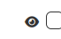
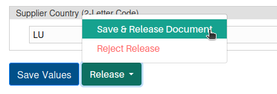
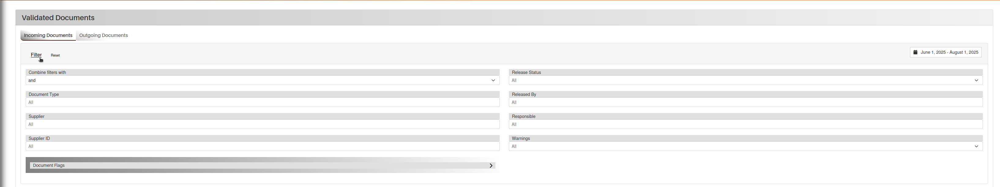

# Validation

## Quel est l’objectif principal

Dans cette page, vous pouvez voir tous les différents documents qui sont entrés dans le système et qui nécessitent une validation par un individu avant d’être acceptés dans le système. Tous les documents qui ont été validés peuvent également être consultés et examinés sur cette page.

Tous les documents peuvent entrer automatiquement dans le système via une connexion avec une adresse e-mail dédiée, ou vous pouvez aussi ajouter manuellement un document au système.

De plus, tous les documents sont séparés entre ceux qui sont entrants et sortants, respectivement pour l’entreprise.

## Comment fonctionne l’algorithme Extractional

L’algorithme Extractional recherchera un modèle adapté et commencera ensuite à extraire les valeurs en fonction de ce modèle. Si certains champs ne sont pas reconnus, ils restent vides, et vous aurez la possibilité de les remplir manuellement (sauf s’ils ont été définis comme champs non modifiables).

En outre, si le système ne trouve aucun modèle correspondant, il n’extraira aucune donnée et laissera tous les champs vides. Une icône visuelle rouge sera affichée sur la validation correspondante.

De plus, si le système trouve deux modèles différents pour le même document, il utilisera simplement le premier.

## Prérequis

Il existe quelques prérequis que nous recommandons avant de commencer à créer et valider le système.

La première chose qui doit déjà être définie dans le système est la création de tous les modèles souhaités, car sinon l’utilisateur ne pourra pas profiter des avantages d’Extractional.

!!! warning "Important"
    En outre, nous recommandons fortement de définir tous les rôles avant d’autoriser la validation dans le système. Cela vous permettra de contrôler qui sont les personnes ayant le droit de valider les documents dans votre système/entreprise.

## Aperçu

{width="1000"}

<h2>Tutoriels vidéo</h2>

<h3>Maîtriser les validations</h3>

<iframe src="https://www.youtube.com/embed/PiAbmcPj8pI?si=a9wZEGUaj3iRwUvl" ... allowfullscreen></iframe>

<h3>Exporter les validations</h3>

<iframe src="https://www.youtube.com/embed/IDB6tKfnY3Q?si=xF9aIbBbNV7dakTC" ... allowfullscreen></iframe>

## Aperçu des principales fonctionnalités

### Créer une nouvelle validation

Dans cette partie, nous expliquerons comment une validation peut être créée. De plus, nous recommandons fortement d’avoir un e-mail dédié directement connecté au système, car cela fera gagner un temps considérable à votre entreprise.

#### Lecture à partir d’une boîte e-mail

L’automatisation par e-mail est définie dans la page des paramètres ; si vous voulez plus d’informations sur cette fonctionnalité, cliquez sur le [lien](Settings.md#imap-monitoring).

#### Insertion manuelle

Dans cette partie, vous trouverez un guide étape par étape sur la façon d’insérer manuellement une nouvelle validation dans le système.

**La première étape** consiste à déclencher le système pour indiquer que vous souhaitez ajouter une nouvelle validation. Cela peut être facilement fait en cliquant sur le bouton « Nouvelle validation » situé en bas à gauche de la page Validation.

Une fois que vous avez cliqué sur le bouton, vous devriez être redirigé vers une nouvelle page qui ressemble à ceci :

{width="1000"}

**La deuxième étape** consiste à sélectionner le fichier que vous souhaitez télécharger dans le système. Cela peut être fait en cliquant sur le bouton `Parcourir...` et en utilisant la boîte de dialogue de sélection de fichiers de votre système d’exploitation.

Après avoir choisi le fichier souhaité, vous devez l’envoyer dans le système en cliquant sur le bouton « Télécharger ». Une fois cliqué, le système ressemblera à ceci :

{width="1000"}

!!! warning "Important"
    **La troisième et dernière étape** consiste à vérifier toutes les entrées dans la section Collecte de données de la page. Voici quelques recommandations : ajouter des notes utiles pour d’autres utilisateurs, compléter et vérifier tous les champs respectifs. La plupart des validations créées auront déjà des valeurs assignées automatiquement grâce aux modèles, mais nous recommandons toujours de tout vérifier et, si nécessaire, de corriger ou compléter certaines valeurs.

Une fois toutes les étapes réalisées, vous aurez deux choix : enregistrer l’entrée actuelle ou la valider. Attention : pour valider une entrée, vous devez avoir les droits nécessaires.

Pour sauvegarder la validation, cliquez sur le bouton « Sauvegarder les valeurs » en bas à gauche de la fenêtre de collecte des données.

Pour revenir à la page principale de validation, cliquez simplement sur le bouton « Retour » en bas à gauche.

### Validation (libération) d’un document

#### Que signifie la libération d’un document dans notre système ?

Dans le contexte de notre système, la libération d’un document correspond au processus d’acceptation du document dans le système global. Après sa libération, il est traité comme **validé**.

!!! warning "Important"
    Attention : pour libérer un document, vous devez avoir les droits nécessaires.

#### Étapes de validation d’un document

La première étape est d’ouvrir une nouvelle validation qui n’a pas encore été libérée. Si vous devez encore en créer une, reportez-vous au [chapitre sur la création d’une validation](#creating-a-new-validation).  
Pour ouvrir une validation existante, cliquez sur l’icône de visualisation correspondante :

{width="50"}

**La deuxième étape, et la plus importante**, est de vérifier toutes les entrées de la fenêtre de collecte des données.  
Pour changer une valeur, cliquez sur le champ correspondant, puis modifiez soit en cliquant sur la valeur correcte dans le fichier, soit en la saisissant manuellement.

!!! warning "Important"
    Vous ne pourrez corriger les valeurs que si le champ est défini comme modifiable. Plus d’informations dans la [page Paramètres](Settings.md#analysis-fields).

Une fois les données vérifiées, vous pouvez décider de libérer le document ou non.

Si vous souhaitez le libérer, cliquez sur le bouton « Libérer » en bas de la fenêtre de collecte des données, puis confirmez l’acceptation. Exemple :

{width="250"}

Après validation, une fenêtre contextuelle vous indiquera si l’opération a réussi.

Si vous souhaitez **refuser** la validation, cliquez également sur le bouton « Libérer » puis choisissez de rejeter. Exemple :

{width="250"}

Si vous refusez une validation, une fenêtre contextuelle apparaîtra pour écrire une note simple expliquant la raison du refus du document ou pour préparer l’e-mail qui sera envoyé à la personne qui a transmis ce document à votre adresse e-mail. Cela dépend bien sûr de la manière dont la validation a été créée ainsi que de la configuration du système.

Une fois que vous avez terminé la libération d’un document, vous pouvez toujours revenir à la page principale de Validation en cliquant sur le bouton « Retour » en bas à gauche de la page.

## Fonctionnalités secondaires et conseils utiles

Dans cette section, nous allons présenter toutes les fonctionnalités secondaires ; elles sont cependant aussi importantes que les principales, car elles amélioreront considérablement votre flux de travail au quotidien.

### Fonction de filtrage

Le filtrage peut être utile lorsque vous essayez de rechercher un document spécifique dans votre système ou si vous souhaitez uniquement traiter un sous-groupe de toutes les validations.

Pour ouvrir le menu de filtrage, vous devez cliquer sur le texte « Filtrer » visible sur la page principale de Validation. Après avoir cliqué sur ce bouton, votre système devrait ressembler à ceci :

{width="1000"}

Maintenant que vous avez ouvert le menu de filtrage, vous pouvez choisir les critères à appliquer ainsi que la manière dont ils doivent être combinés. Vous avez deux options : **« et »** ou **« ou »**.

De plus, si vous souhaitez supprimer tous les filtres, vous pouvez cliquer sur le champ texte `Réinitialiser` situé à côté du texte `Filtrer`. Tous les filtres seront alors remis à leur état par défaut.

### Modification de la période

Une autre fonctionnalité secondaire est de définir la période de temps des documents que vous souhaitez visualiser. Cette période détermine quels documents apparaissent dans le tableau de validation. La date considérée est la **date d’entrée du document dans le système**.

!!! warning "Important"
    La période est toujours considérée en plus des filtres et de la recherche en texte intégral. Si un document ne correspond pas à la période définie, il ne peut jamais être trouvé, indépendamment des filtres ou des critères de recherche.

Pour définir la période, cliquez simplement sur l’icône calendrier en haut à droite du système. Vous verrez la fenêtre suivante :

{width="750"}

Vous avez deux possibilités :  
- Choisir une option prédéfinie sur le côté gauche (exemple : `7 derniers jours`)  
- Définir une période personnalisée en sélectionnant une date de début puis une date de fin avec votre souris.

Une fois satisfait, cliquez sur le bouton `Appliquer` en bas à droite de la fenêtre.

!!! warning "Important"
    Le temps de chargement peut être long, surtout si un grand nombre de fichiers doivent être chargés dans le système.

### Utilisation de la barre de recherche

Si vous souhaitez rapidement trouver un fichier spécifique, vous pouvez utiliser la barre de recherche.

#### Comment utiliser la barre de recherche

Écrivez une information concernant le fichier recherché dans le champ texte situé à côté de `Recherche`.

Une fois le texte saisi, le système effectuera une recherche dans tous les fichiers de la table actuelle. Il trouvera les éléments contenant l’intégralité des informations saisies.

!!! warning "Important"
    Les seuls champs disponibles pour la recherche sont ceux qui ont été définis comme *« activés »* ou *« cachés »*.

Veuillez noter que le système ne recherche que dans les métadonnées visibles dans la page principale de validation.

### Lier des personnes aux documents

Dans cette partie, vous apprendrez à assigner une validation à un utilisateur du système. Cela peut être utile si vous souhaitez désigner quelqu’un pour libérer un document spécifique ou préciser le responsable du document.

Cliquez sur l’icône suivante :

{width="75"}

Une fenêtre s’ouvrira, et vous pourrez lier une personne à la validation choisie.

### Exportation de documents

Dans cette partie, nous expliquerons comment exporter des documents dans un format choisi.

Deux options existent : exporter un seul document ou exporter l’intégralité de la table.

!!! warning "Important"
    Attention : tous les documents que vous souhaitez exporter doivent être libérés.  
    Si vous choisissez d’exporter en CSV ou XML, le format doit aussi être défini dans les paramètres. (Lien explicatif à ajouter.)

#### Exporter un seul fichier

Commencez par afficher le fichier à exporter.

La section d’exportation se trouve en bas de la fenêtre de collecte des données et ressemble à ceci :

{width = 750}

Définissez le format d’export souhaité, puis cliquez sur le bouton « Soumettre ».

#### Exporter toute la table

Pour exporter plusieurs fichiers, commencez par filtrer la table pour n’afficher que les validations à exporter.

!!! warning "Important"
    Attention : cette action exportera toutes les validations visibles dans la **table entière**.

Ensuite, cliquez sur le bouton `Exporter la sélection` en bas de la page. Une fenêtre apparaîtra pour choisir le format et confirmer avec le bouton `Ok`.

Tous les fichiers seront exportés dans un dossier compressé `.zip`.

## Amélioration du flux de travail

Dans cette partie, nous allons aborder deux fonctionnalités principales du système qui permettent d’améliorer vos workflows.

### Utilisation des indicateurs (flags)

Notre système utilise des indicateurs pour définir l’état d’une validation. Chaque indicateur est associé à une icône et apparaît sous la zone fournisseur dans le document. Exemple :

{width="500"}

#### Comment utiliser les indicateurs

Les indicateurs permettent aux utilisateurs de comprendre rapidement l’état d’une validation existante. Ils aident aussi à savoir si une tâche a déjà été effectuée.

Exemples d’indicateurs courants :  
- `Payé`  
- `Vérifié`  
- `etc.`

### Revue rapide de plusieurs documents

Notre système permet également de sélectionner plusieurs documents pour les revoir rapidement, améliorant ainsi l’efficacité du workflow.

Sélectionnez les documents souhaités, puis cliquez sur le bouton de visualisation représenté par cette icône :

{width="75"}

Après avoir cliqué, vous serez redirigé vers une page de visualisation similaire à celle d’un seul document, mais avec plusieurs onglets en haut, représentant chaque fichier. Exemple :

{width="750"}

Chaque onglet est coloré en fonction de l’état du document (mêmes couleurs que dans la table des validations).

Vous pouvez ainsi rapidement parcourir tous les fichiers sans revenir à la page principale.