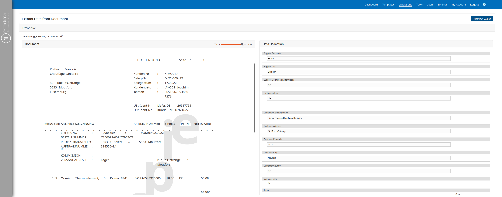
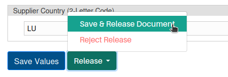
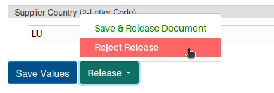
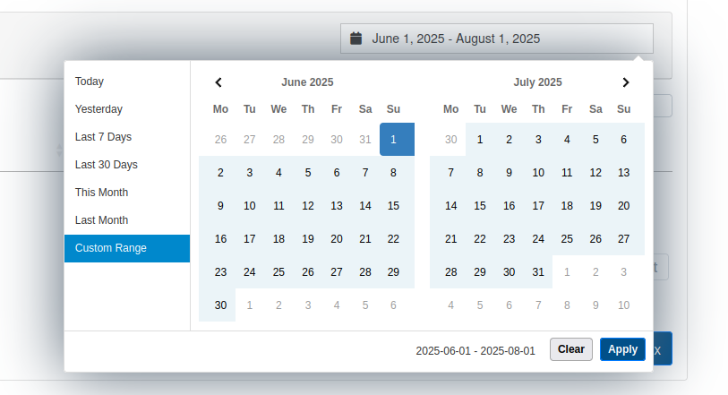
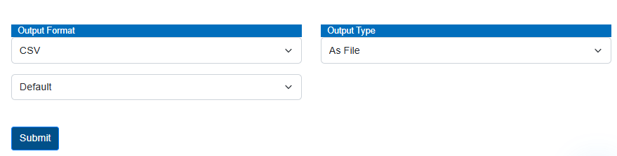

# Validation

## What is the main purpose

In this page, you can see all the different documents that have entered
that system and that need validation from an individual before being
accepted into the system. All documents that have been validated are
also seen and reviewed on this page.

All documents can automatically enter the system via a connection with a
dedicated e-mail address, or you can also manually add a document to the
system by entering it.

Additionally, all the documents are separated from the ones that are
incoming and outgoing respectively to the company.

## How does the Extractional algorithm work

The Extractional algorithm will search for a suitable template and then
start to extract the values according to this template. It fields are
not recognized, they stay empty, and you will have the possibility to
fill them manually (unless it has been defined as non-type-in field).

In addition, if the system does not find any corresponding templates, it
will not extract any data and let all fields empty. A red visual icon
will be present on the respective validation.

Moreover, if the system finds two different templates for the same
document, it will simply be the first one.

## Prerequisites

There are a few prerequisites that we recommend before starting to
create and validate the system.

The first thing that shall be already defined in the system is having
created all the desired templates, since otherwise the user cannot
profit from the advantages of Extractional.

!!! warning "Important"
    In addition, we also highly recommend defining all roles before allowing
    validation in the system. This will allow you to control who are the
    people who shall have the control to validate documents in your
    system/company.

## Overview

{width="1000"}

<h2>Video tutorials</h2>

<h3>Mastering validations</h3>

<iframe src="https://www.youtube.com/embed/PiAbmcPj8pI?si=a9wZEGUaj3iRwUvl" frameborder="0" allow="accelerometer; autoplay; clipboard-write; encrypted-media; gyroscope; picture-in-picture; web-share" referrerpolicy="strict-origin-when-cross-origin" allowfullscreen></iframe>

<h3>Exporting validations</h3>

<iframe src="https://www.youtube.com/embed/IDB6tKfnY3Q?si=xF9aIbBbNV7dakTC" frameborder="0" allow="accelerometer; autoplay; clipboard-write; encrypted-media; gyroscope; picture-in-picture; web-share" referrerpolicy="strict-origin-when-cross-origin" allowfullscreen></iframe>

## Main Functionalities Overview

### Creating a new validation

In this part, we will explain how a validation can be created.
Additionally, we highly recommend having a dedicated e-mail directly
connected to the system, since this will save your company a considerate
amount of time.

#### Reading from an e-mail inbox 

Automation via email is set on the settings page; if you want more
information about this feature, please click the following
[link](Settings.md#imap-monitoring).

#### Manual insertion 

In this part, you shall find a step-by-step guide on how to manually
insert a new validation in the system.

**The first step** will be to trigger the system to know that you want
to add a new validation. This can be easily done by clicking on the new
validation button. This button can be seen on the bottom left corner of
the Validation page.

Once you have clicked the new validation button, you should be presented
with a new page that should look like this:

{width="1000"}

**The second step** will then be to select the file that you want to
upload to the system. This can be easily done by clicking the
\"Browse\...\" button and using your operating system's file-selection
dialog to choose the file.

After having chosen the desired file to upload, you shall only upload
the file into the system, this by clicking the \"upload\" button. Once
you have clicked this button, the system will look something like this:

{width="1000"}

!!! warning "Important"
    **The third and final step** will be to verify all the entries in the
    Data Collection section of the page. Here we have a few recommendations
    that you should take into account. The first would be to add any notes
    that might be helpful for the others in the future. Another would be to
    complete and verify all the respective fields; usually most of the
    validations that will be created will automatically have all the values
    already assigned to it due to automation made with the templates in the
    system, but we always recommend checking all the fields to possibly
    filling or correcting some of the values.

Once you have achieved to do all the different steps, you will have two
choices, you can either save the current entry or you could release it.
Please, pay attention that to release one validation you need to have
the rights to do it, more information about releasing a document is
available in the [following chapter].

To save the validation, you will need to click on the \"Save values\"
button, which can be seen in the bottom left corner of the Data
collection window.

Additionally, to go back to the main validation page, you only need to
click on the \"back\" button found in the bottom left corner of the
page.

### Releasing a document

#### What does releasing one document in the context of our system mean 

In the context of our system, the release of a document is the process
of accepting a document into the overall system and shall be treated as
a **validated** document after it is released.

!!! warning "Important"
    Be aware that to release a document, you will need to have the rights to
    do it.

#### How to release a document step-by-step

In the following paragraphs, you will find a step-by-step guide on how
to properly release a document.

The first step in this process will be to open a new validation that is
still not released, if you still need to create this new validation,
please go back to the [`Creating a new validation
chapter`](#creating-a-new-validation) that shows how to create a new
validation. In addition, to open an existing validation, you will need
to click on the view icon on the desired validation. The visualization
icon can be seen as such:

{width="50"}

**The second and most important step** in this process is to verify all
the entries in the Data Collection window. If you wish to change any
values in the Data Collection part, you will need to click on the
desired field first and change the value by right-clicking the correct
value on the file or you can also manually type the correct value.

!!! warning "Important"
    You will only be able to correct the values if the field is set to allow manual changes. For more information, please consult the [`Settings page`](Settings.md#analysis-fields)

Once you have finished verifying all the data from the data collection
window, you can decide whether you want to release the document or not.

If you wish to release the document, it is as simple as clicking the
Release button at the bottom of the Data Collection window followed by
choosing to accept the release. To help you find this sequence of
buttons, you can use the following illustration to help you:

{width="250"}

Once you have released the document, a pop-up page will appear that will
notify you if the operation has been successful or not.

On the other hand, if you would like to refuse the release of the
current validation, you can simply click on the Release button on the
bottom of the Data Collection window followed by choosing to reject the
release. To help you find this sequence of buttons, you can use the
following illustration to help you:

{width="250"}

If you reject a validation, a pop-up page will
appear to either write a simple note explaining the reason behind
refusing the document or it could also prepare the e-mail the shall be
sent to the incoming person that has send this document to your email.
This, of course, depends on how validation has been created as well as
how the system has been defined.

Once you have finished Releasing a document, you can always go back to
the main Validation page by clicking on the \"back\" page on the bottom
left corner of the page.

## Secondary Functionalities and useful Tips

In this section, we will show all the secondary functionalities; these
however are as important as the main ones since these ones will
considerably improve your workflow during the day.

### Filtering function

Filtering can be helpful when trying to search for a specific
document in your system or want to only treat a subgroup of all
validations in your system.

To trigger this filter menu, you need to click on the \"Filter\" text
that is visible on the main Validation page. After having clicked on the
Filter button, your system shall look like this:

{width="1000"}

Now that you have opened the filter menu or can choose what to filter
all the criteria as you would like as well as how the should be
combined. You have two options on how to combine the filters, you can
either choose the **"and"** or the **"or"** option in the combine
filters with box.

Moreover, if you wish to remove all the filters, you can click on the
`Reset` text field that is situated right next to the `Filter` text
field and all the filters will reset to their default settings.

### Changing timetable

One of the secondary systems on this page is also to define the time period
of all the documents you wish to visualize. The tme period defines what documents
are shown in the validation table. Additionally, the date referred in this context is the date
regarding the **entry of the document in the system**.

!!! warning "Important"
    The time table is always considered additionally to filters and full te-text search.
    If a document does not fall into the selected time period, it can never be found,
    independently of filters or search criteria.

This time period can be defined
by simply clicking the date icon on the top right corner of the system,
and you will be shown the following window to change the dates:

{width="750"}

From here, you will be able to choose a new time period. You have two
possibilities on how to change the time period, the first one is by
choosing one of the options that is available on the left side of the
window (example: `Last 7 Days`). The other possibility is to
define a custom time period, this can be done by choosing the starting day
on the time period and left-click with your mouse and then choosing the
starting day end day of your time period and left-click with your mouse
again.

Once you are satisfied with your time period, you can click on the
`Apply` button in the bottom right corner of this window.

!!! warning "Important"
    Please be aware that the loading time can take some time, especially if
    there are a lot of files that need to be loaded into the system.

### Usage of search bar

If you would like to quickly find a specific file, you can always take
usage of the search bar.

#### How to use the search bar 

To use the search bar, you will need to write some information of the
file that you are looking for in the text box that is next to the
`Search` text field.

Once you have entered some text in the text bar, teh system will perfom a search for all files contained in the current table.
The system will look for elements where it can find the entirity of the information given.

!!! warning "Important"
    The only fields that are available for searching are those that have been set to *"activated"* or *"hidden"*. 

Once you have entered some text in the text bar, the system will look
for any file that will containing some meta-information equal to the one
you have just entered.

Please pay attention that the system will only look within all
meta-information. In other words, all the information that can be seen
from each in the main validation page.

### Linking people to documents

In these part you will learn how to assign a certain validation for a
user that is inside your system. This can be helpful if you would like
to assign someone to release a specific document or want to specify the
person that is responsible for that specific document.

To do so, you first need to click on the respective icon that is shown
below:

{width="75"}

Once you have clicked on that icon, a new window will pop out and you
will be able to link someone to the chosen validation.

### Exporting Documents

In this part, we will discuss how to export documents in a chosen
format.

There are two main ways to export documents, you have the possibility to export a single
document or you can also export the entirety of the current table that is represented.

!!! warning "Important"
    Be aware that all documents that you would like to export must be
    released, and if you choose to export in CSV or XML format, the format
    must also be defined in the settings. More information about exporting
    formats in the following link (STILL TO DO).

#### Exporting a single file

To export a single document, you will start by viewing the file that you would like to export.

The exporting section can then be found at the bottom of the data collection window. The section shall look like this:

{width = 750}

In this section of the page, you will be able to define the export format that you would like to perform and click on the submit button.

#### Exporting te entirety of the table

To export several files at once you shall start by filtering your validations table to only represent the validations that you would like to export.

!!! warning "Important"
    Please be aware that this manipulation will export all validations visible in the **entire table**-

In order to export all documents available in the table, you need to click on the `Export Selection` button found at the bottom of the page.
You will be presented with a new window where you need to choose the export format and confirm your choice by clicking on the `Ok` button. 

All teh files will be then exported a compressed .zip folder.

## Improvement of Workflow

In this part, we will talk about to main points featured in our system
that will allow you to improve your workflows.

### Usage of Flags

Our system uses flags allowing us to define the state of a certain
validation. All flags have an associated icon and will be visible in each
validation under the supplier box in the document itself. Here is an
example of a validation already with two flags associated with it.

{width="500"}

#### How to take advantage of flags

Flags allow every user to quickly understand the state of an existing validation.
They can also help you understand if a certain task has already been done in a validation.

Typical flags in the system are:

- `Paid`
- `Reviewed`
- `Paid`
- `etc.`

### Quickly review several documents

In addition, our system also has a method implemented allowing to select
several documents to quickly review them. This, again will
allow you to improve the efficiency of your workflow.

To use this feature, you will select all the documents that you would
like to review followed by clicking on
the visualization button on one of the files. The visualization button
is represented by the following icon:

{width="75"}

After clicking on the view button you will be then transferred to the
view page as if it was for only one document, but this time, you will
have all the several files represented on the top as if they were tabs
in a browser. To help you visualize where you can select each document,
you can use the following visualization to help guiding you.

In addition, each tab's color also represents the document's state with the same colors as in the validations table.

{width="750"}

Now you can quickly review all the desired files without needing to
always go back to the main page.