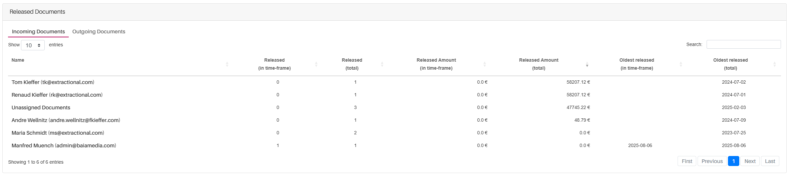

*Version: {{ page.meta.version }}*

# Systemübersicht

In diesem Kapitel erhalten Sie ein detailliertes Handbuch, das
erklärt, wie jede Hauptseite im System funktioniert, sowie alle
Hauptfunktionen des Systems beschreibt.

!!! warning "Wichtige Information"
    Bitte beachten Sie, dass einige Menüeinträge, die in diesem Teil
    des Handbuchs angezeigt werden, für Sie möglicherweise nicht
    verfügbar sind; dies hängt direkt von den Rechten ab, die Sie
    im System besitzen.

## Allgemeine Prinzipien

### Allgemeine Navigationsprinzipien für alle Tabellen

Beispiel einer Tabelle:

{width="1000"}

Um die Benutzerfreundlichkeit aller Tabellen zu verbessern, stehen
mehrere Navigationsfunktionen zur Verfügung:

- Um zwischen **Eingehenden** und **Ausgehenden** Dokumenten zu wechseln,
  verwenden Sie die Registerkarten oben in der Tabelle.

- Um **Tabellenelemente** nach einer bestimmten Spalte zu sortieren,
  klicken Sie auf die Spaltenüberschrift. Ein Symbol zeigt die aktuelle
  Sortierreihenfolge an (aufsteigend oder absteigend). Durch wiederholtes
  Klicken wechseln Sie zwischen den Sortieroptionen oder entfernen die Sortierung.

- Um nach einer bestimmten Zeile zu suchen, verwenden Sie die Suchleiste
  oben rechts in der Tabelle. Die Suche erfolgt basierend auf den in der
  Tabelle sichtbaren Informationen.

- Um die Anzahl der pro Seite angezeigten Zeilen anzupassen, klicken Sie
  auf die aktuelle Anzeige für die Anzahl der Elemente pro Seite oben
  in der Tabelle und wählen Sie die gewünschte Anzahl.

- Um zwischen den Seiten zu navigieren, verwenden Sie die Paginierung
  unten in der Tabelle.
