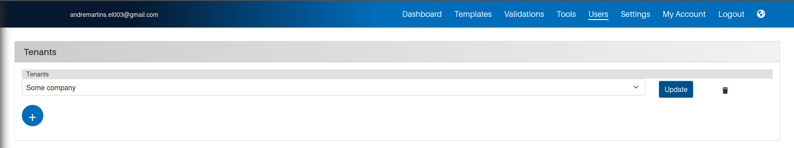

*Version: {{ page.meta.version }}*

  <a class="md-button print-button" href="../pdfs/Multi tenant system.pdf" target="_blank">
    Diesen Abschnitt als PDF herunterladen
  </a>

# Systemeinrichtung

In diesem Abschnitt erfahren Sie, wie Sie das System einrichten und wie Sie jeden Benutzer für jeden Tenant definieren, wie wir sie nennen.

## Hinzufügen aller Unterorganisationen im System

Der erste Schritt dieses Prozesses besteht darin, alle Ihre Unterorganisationen im System hinzuzufügen. Gehen Sie dazu auf die Hauptseite `Benutzer` und navigieren Sie zum Kachel `Tenants`.

{width=1000}

Sobald Sie sich am richtigen Ort befinden, müssen Sie alle Tenants hinzufügen. Dazu lösen Sie das System aus, indem Sie auf das `Plus`-Symbol am unteren Rand des Tenants-Fensters klicken.

Anschließend müssen Sie alle entsprechenden Koordinaten der Unterorganisationen hinzufügen und diese durch Klicken auf die Schaltfläche `Absenden` speichern.

### Bearbeiten eines bestehenden Tenants

Sie haben jederzeit die Möglichkeit, einen der Tenants in Ihrem System zu ändern, indem Sie auf die Schaltfläche `Aktualisieren` neben dem derzeit ausgewählten Tenant klicken.

## Hinzufügen aller Benutzer für jede Organisation

Sobald alle Tenants definiert sind, können Sie nun alle Benutzer für jede Organisation festlegen.

!!! warning "**Einige Vorsichtsmaßnahmen vor dem Hinzufügen von Benutzern**"
    - Jeder Benutzer muss eine eindeutige E-Mail-Adresse über alle Tenants hinweg haben.

## Festlegen aller Berechtigungen für alle Benutzer sowie anderer Präferenzen

**Dieser Abschnitt befindet sich noch in der Entwicklung**
