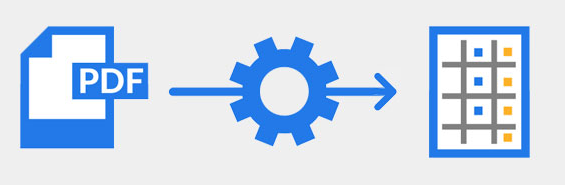
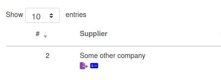

*Version: {{ page.meta.version }}*

  <a class="md-button print-button" href="./pdfs/System Overview and User Management.pdf.pdf" target="_blank">
    Diesen Abschnitt als PDF herunterladen
  </a>

# Einführung

Dieses Kapitel bietet einen Überblick über das System und beschreibt
seine Hauptkomponenten und Funktionen. Es erklärt, wie die
Verantwortlichkeiten auf verschiedene Benutzerrollen verteilt sind,
hebt wichtige Sicherheits- und Zugriffspunkte hervor und beschreibt die
verschiedenen Ansichten in der Benutzeroberfläche.  
Das Verständnis dieser Grundlagen hilft den Benutzern, das System
effektiv zu bedienen.

???+ info
    -   `Dokument:` In unserem System beziehen wir uns mit Dokumenten auf
        **Rechnungen, Gutschriften, Lieferscheine, Bestellformulare,
        Auftragsbestätigungen**, also auf alle finanziellen Dokumente,
        die in Unternehmen üblicherweise ausgetauscht werden.

    -   `Validierung:` Entität in unserem System, die ein eingehendes oder
        ausgehendes Dokument darstellt, das registriert wurde.

    -   `Vorlagen:` Eine Vorlage ist eine Entität, die als Referenz dient,
        um Daten aus weiteren ein-/ausgehenden Dokumenten zu extrahieren.

    -   `"Kopfdaten/Fußdaten":` Alle Felder, die den Kopf- und Fußbereich
        des Dokuments bilden (allgemeine Dokumentinformationen).

    -   `"Positionen":` Positionierte Elemente des Dokuments, d.h. Daten,
        die für die Peppol-Datenextraktion verwendet werden.

## Zweck und Funktionen

Willkommen im Benutzerhandbuch von Extractional. In diesem Leitfaden
finden Sie umfassende Informationen zur effektiven Nutzung unseres
Systems. Vorab geben wir einen kurzen Überblick über den Zweck und
erklären, wie Ihr Unternehmen Prozesse optimieren und Zeit sparen kann.

### Extraktion und Automatisierung von Einkaufsdokumenten

Das Hauptziel unseres Systems ist es, Daten aus allen ein- und
ausgehenden Einkaufs- und Abrechnungsdokumenten zu extrahieren.  
Die extrahierten Daten können anschließend verarbeitet, für automatisierte
Prozesse genutzt und in andere Systeme exportiert werden.

#### PDF-Dateien extrahieren

Unsere Software extrahiert Daten aus allen PDF-Dateien. Dadurch müssen
Nutzer ihre bisherigen Abläufe nicht ändern und können weiterhin das
am weitesten verbreitete Format verwenden.

{ width="300"}
/// caption

///

#### Direkte E-Mail-Anbindung

{width="50" align=left}

Die Software fügt automatisch alle eingehenden Rechnungsdokumente ins
System ein, indem sie sich direkt mit einer E-Mail-Adresse verbindet.
Dies geschieht über IMAP, das von den meisten Mail-Anbietern unterstützt
wird.

### Nutzung numerischer Daten

Ein wesentlicher Vorteil unseres Systems ist die vollständige Nutzung
numerischer Daten. Das erleichtert die Organisation Ihres Unternehmens
und verbessert tägliche Arbeitsabläufe.

#### Vereinfachte Dokumentenkontrolle

Eines unserer Hauptziele war es, die Organisation von Dokumenten
einfach und zeitsparend zu gestalten.  

Da die Menge an Dokumenten für viele Unternehmen überwältigend ist,
unterstützt unser System durch Statusverfolgung, automatische Zuweisung
an Mitarbeiter und visuelle Markierungen.

{width="600"}
/// caption
*Beispiel einer Datei mit zwei Markierungen*
///

#### Verbesserte Dateisuche

{width="50" align=left}

Das System nutzt digitale Speicherung sowie schnelle Such- und
Filteralgorithmen, sodass Dokumente effizient gefunden werden können.

#### Weniger Papierverbrauch

{width="50" align=left}

Durch Automatisierung entfällt die Notwendigkeit, Dokumente auszudrucken.
So kann Ihr Unternehmen nahezu papierlos arbeiten.

## Benutzerverwaltung

Eine Kernfunktion unseres Systems ist die Definition verschiedener
Benutzerrollen und die automatische Arbeitsverteilung.

### Benutzerrollen

Unser System bietet vordefinierte Rollen und erlaubt die Erstellung
neuer Rollen. Jede Rolle hat eigene Berechtigungen, die den Zugriff und
die Möglichkeiten im System bestimmen.

#### Berechtigungen

Berechtigungen steuern den Zugriff auf Dokumente, deren Erstellung,
Änderung und Löschung.

{width="500"}
/// caption
*Abbildung aller verfügbaren Berechtigungen im System*
///

Verfügbare Berechtigungen:

-   `Vorlagen lesen:` Zugriff auf alle Vorlagen.  
-   `Vorlagen erstellen:` Neue Vorlagen anlegen, ändern oder löschen.  
-   `Validierungen lesen:` Zugriff auf alle Validierungen.  
    -   `Nur eigenes Konto:` Sicht nur auf eigene Validierungen.  
-   `Validierungen erstellen:` Neue Validierungen erstellen
    (zunächst unverifiziert).  
-   `Validierungen ändern/speichern:` Änderungen vornehmen und speichern.  
-   `Validierungen prüfen:` Dokumente prüfen und freigeben.  
-   `Einstellungen lesen:` Einstellungen einsehen, ohne Änderungen.  
-   `Einstellungen ändern:` Änderungen in definierten Bereichen
    vornehmen.  
-   `Benutzerdaten lesen:` Zugriff auf alle Benutzerdaten.  
-   `Benutzer erstellen/ändern:` Neue Benutzer anlegen oder ändern.  
-   `SEPA-Daten lesen:` Zugriff auf Zahlungsinformationen.  
-   `SEPA-Daten erstellen:` Zahlungsdaten für Automatisierung anlegen.  
-   `Zahlung bestätigen:` Dokumente als „Bezahlt“ markieren.  

#### Warum Benutzerrollen?

Rollen vereinfachen die Verwaltung: Änderungen müssen nur einmal auf
Rollenebene vorgenommen werden, nicht bei jedem Nutzer einzeln.

### Vereinfachtes Teammanagement

Unser System ermöglicht die Überwachung der Teamlast und sorgt für eine
gleichmäßige Aufgabenverteilung.

## Nahtlose Integration von Einkauf und Buchhaltung

{width="50" align=left}

Extractional schafft eine transparente Verbindung zwischen Einkauf und
Buchhaltung.  
Alle vom Einkauf extrahierten und analysierten Daten bieten der
Buchhaltung einen klaren Überblick über die Transaktionen.

### Datenexport

Das System erlaubt den Export in folgende Formate:

-   **`XML:`** z.B. für **Sage BOB50**.  
-   **`JSON:`** für Datenaustausch zwischen Extractional-Systemen.  
-   **`CSV:`** für Tabellenkalkulationen wie Excel.  
-   **`Peppol:`** internationaler Standard für elektronische Dokumente.  
-   **`SEPA:`** XML-Format für automatische Zahlungen.  

## Sicherheit und Zugriffskontrolle

Ein Hauptaugenmerk liegt auf Dokumentensicherheit und Zugriffskontrolle.

### Sicherheit in der Datenbank

Alle Dokumente bleiben innerhalb Ihres Unternehmensservers.  
Daten verlassen Ihr Netzwerk nur, wenn Sie es ausdrücklich veranlassen.

### Zugriffskontrolle

- **Rollenbasierte Zugriffskontrolle.**  
- **Login-Tracking:** Jeder Login wird mit IP-Adresse und Ergebnis
protokolliert.  

{width="1000"}
