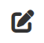

*Version: {{ page.meta.version }}*

  <a class="md-button print-button" href="../../pdfs/de/System Overview-Users.pdf" target="_blank">
    Diesen Abschnitt als PDF herunterladen
  </a>

# Benutzer

## Hauptzweck

Auf dieser Seite können Sie alle Benutzer verwalten und überwachen,
die Zugriff auf Ihr System und Ihre Daten haben.  
Außerdem können Sie hier Benutzer hinzufügen oder entfernen.

## Voraussetzungen

Bevor Sie Benutzer verwalten oder hinzufügen, empfehlen wir Ihnen,  
alle Rollen im System festzulegen sowie die jeweiligen Rechte jedes Benutzertyps zu definieren.

## Übersicht

{width="1000"}

<h2>Video-Tutorial</h2>

<iframe src="https://www.youtube.com/embed/wantwfXFLYc?si=bkxPJGAFK2s_ZJZw" frameborder="0" allow="accelerometer; autoplay; clipboard-write; encrypted-media; gyroscope; picture-in-picture; web-share" referrerpolicy="strict-origin-when-cross-origin" allowfullscreen></iframe>

## Administrator-Handbuch

In diesem Abschnitt finden Sie alle technischen und wichtigen Informationen zur Benutzerverwaltung.

**Bedeutung von Benutzername und E-Mail**

Extractional legt großen Wert auf den Benutzernamen und insbesondere auf die E-Mail-Adresse.  
Im System muss jede E-Mail-Adresse eindeutig sein und darf nur einmal während der gesamten
Lebensdauer der Software verwendet werden.  
Dies gilt auch für **gelöschte Benutzer**.

**Wie unser System mit gelöschten Benutzern umgeht**

In unserem System wird ein Benutzer nie vollständig gelöscht.  
Der Grund dafür ist, die Nachverfolgbarkeit aller Validierungen,  
die von diesem Benutzer bearbeitet wurden, sicherzustellen.

So können Sie immer nachvollziehen, welche Person für eine Validierung verantwortlich war.

!!! warning "Wichtig"
    Wir empfehlen, einen Benutzer auf `inaktiv` zu setzen,  
    wenn Sie nicht sicher sind, ob er zukünftig wieder benötigt wird.  
    `Inaktive` Benutzer können sich nicht im System anmelden.

## Benutzermerkmale

Es gibt zwei Haupttypen von Benutzermerkmalen:  
die, die nur zur Identifizierung dienen, und die, die den Zugang und die Rechte im System festlegen.

Im Folgenden betrachten wir nur die Merkmale, die die Nutzung des Systems beeinflussen.

#### Status 

Zeigt den aktuellen Zustand eines Benutzerkontos oder einer Sitzung an.  
Das System kennt folgende Status:

-   `Aktiv` Das Benutzerkonto ist voll funktionsfähig und hat Zugriff auf alle Funktionen.
-   `Inaktiv` Das Konto ist deaktiviert. Der Benutzer kann sich nicht anmelden, bis es reaktiviert wird.
-   `Passwort bestätigen` Der Benutzer muss sein Passwort bestätigen oder zurücksetzen, bevor er vollen Zugriff erhält.
-   `Zahlung erforderlich` Das Konto ist vorübergehend gesperrt, bis ausstehende Zahlungen beglichen sind.

Je nach Status kann der Benutzer das System nutzen oder nicht.  
Das System ändert den Status ggf. automatisch,  
aber mit den entsprechenden Rechten können Sie einen **AKTIVEN** Benutzer auch manuell **INAKTIV** setzen.

#### Rolle

Die Rolle bestimmt, welche Bereiche ein Benutzer sehen oder bearbeiten darf.  
Das System enthält vier vordefinierte Rollen: Superuser, Admin, Ersteller und Prüfer.  
Sie können jedoch weitere Rollen erstellen und deren Rechte individuell festlegen.  
Mehr Informationen dazu finden Sie im Abschnitt über Rollen.

## Übersicht der Hauptfunktionen

In diesem Abschnitt erfahren Sie, wie Sie die wichtigsten Funktionen auf dieser Seite nutzen.

!!! warning "Wichtig"
    Nur Benutzer mit entsprechenden Rechten können neue Benutzer anlegen oder bestehende ändern.

### Neuen Benutzer hinzufügen

Um einen Benutzer hinzuzufügen, gehen Sie zuerst auf die Hauptseite `Benutzer`.  
Falls Sie sich nicht auf dieser Seite befinden,  
klicken Sie im Navigationsmenü oben auf `Benutzer`.

Dort klicken Sie unten auf das Plus-Symbol, um die Erstellung zu starten.  
Das Symbol sieht so aus:

{width="75"}

Sie werden zu einem Formular weitergeleitet, das Sie mit den Benutzerdaten ausfüllen.  
Klicken Sie anschließend unten auf `Absenden`.  
Dem neuen Benutzer wird ein Einladungslink per E-Mail zugeschickt.

#### Einladung annehmen

**FUNKTION NOCH IN TEST, derzeit wird keine Einladung verschickt**

### Benutzerinformationen bearbeiten

Suchen Sie den gewünschten Benutzer und klicken Sie auf das Bearbeitungssymbol:

{width="75"}

Sie gelangen auf ein Formular mit allen vorhandenen Daten.  
Änderungen können Sie manuell eingeben oder aus vorgeschlagenen Optionen wählen.  
Zum Speichern klicken Sie auf `Absenden`.  
Um Änderungen zu verwerfen, klicken Sie auf den Zurück-Button unten.

### Benutzer löschen

!!! warning "Wichtig"
    Achtung: Gelöschte Benutzer können nicht wiederhergestellt werden!  
    Wenn Sie nur den Zugriff entziehen möchten, ändern Sie besser den **Status**.

Um einen Benutzer zu löschen, klicken Sie auf das Löschsymbol neben dem Benutzerprofil und bestätigen Sie.  
Das Symbol sieht so aus:

{width="75"}

### Login-Historie anzeigen

Neben der Benutzerverwaltung können Sie auch die gesamte Login-Historie einsehen.  
Dies hilft, den Zugriff auf Ihr System zu kontrollieren.  

Klicken Sie dazu auf den Reiter `Login-Historie` oben auf der Seite.

{width="350"}

Die folgende Seite zeigt Ihnen eine Übersicht der Anmeldungen:

{width="1000"}

Hier sehen Sie alle Login-Versuche sowie zusätzliche Informationen  
(Stadt, Land, Status usw.).
