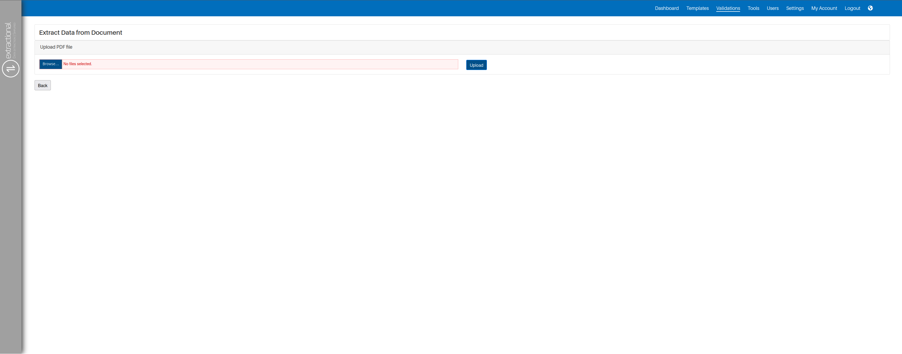
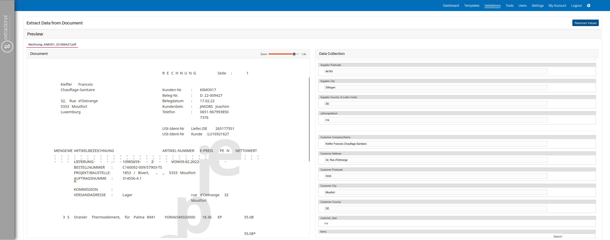

*Version: {{ page.meta.version }}*

  <a class="md-button print-button" href="../pdfs/System Overview-Settings.pdf" target="_blank">
    Diesen Abschnitt als PDF herunterladen
  </a>

# Validierung

## Was ist der Hauptzweck

Auf dieser Seite können Sie alle verschiedenen Dokumente sehen, die in das System eingegangen sind und die von einer Person validiert werden müssen, bevor sie ins System aufgenommen werden. Alle bereits validierten Dokumente sind ebenfalls auf dieser Seite sichtbar und überprüfbar.

Alle Dokumente können automatisch über eine Verbindung mit einer dedizierten E-Mail-Adresse in das System gelangen, oder Sie können ein Dokument manuell hinzufügen.

Zusätzlich werden alle Dokumente in eingehende und ausgehende Dokumente des Unternehmens unterteilt.

## Wie funktioniert der Extractional-Algorithmus

Der Extractional-Algorithmus sucht nach einer passenden Vorlage und beginnt dann, die Werte gemäß dieser Vorlage zu extrahieren. Werden Felder nicht erkannt, bleiben sie leer, und Sie haben die Möglichkeit, diese manuell zu füllen (außer wenn sie als nicht editierbar definiert wurden).

Falls das System keine passende Vorlage findet, extrahiert es keine Daten und lässt alle Felder leer. Ein rotes Symbol wird in der entsprechenden Validierung angezeigt.

Falls das System zwei verschiedene Vorlagen für dasselbe Dokument findet, wird einfach die erste verwendet.

## Voraussetzungen

Es gibt einige Voraussetzungen, die wir empfehlen, bevor Sie mit der Erstellung und Validierung im System beginnen.

Das erste, was im System definiert sein sollte, ist die Erstellung aller gewünschten Vorlagen, da der Benutzer ansonsten nicht von den Vorteilen von Extractional profitieren kann.

!!! warning "Wichtig"
    Darüber hinaus empfehlen wir dringend, alle Rollen zu definieren, bevor Validierungen im System erlaubt werden. Dies ermöglicht es Ihnen zu steuern, wer in Ihrem Unternehmen die Berechtigung hat, Dokumente zu validieren.

## Übersicht

{width="1000"}

<h2>Video-Tutorials</h2>

<h3>Validierungen meistern</h3>

<iframe src="https://www.youtube.com/embed/PiAbmcPj8pI?si=a9wZEGUaj3iRwUvl" ... allowfullscreen></iframe>

<h3>Validierungen exportieren</h3>

<iframe src="https://www.youtube.com/embed/IDB6tKfnY3Q?si=xF9aIbBbNV7dakTC" ... allowfullscreen></iframe>

## Übersicht der Hauptfunktionen

### Eine neue Validierung erstellen

In diesem Abschnitt erklären wir, wie eine Validierung erstellt werden kann. Wir empfehlen außerdem dringend, ein dediziertes E-Mail-Konto direkt mit dem System zu verbinden, da dies Ihrem Unternehmen erheblich Zeit spart.

#### Aus einem E-Mail-Postfach lesen

Die Automatisierung per E-Mail wird auf der Einstellungsseite eingerichtet. Weitere Informationen zu dieser Funktion finden Sie unter folgendem [Link](Settings.md#imap-monitoring).

#### Manuelle Eingabe

Hier finden Sie eine Schritt-für-Schritt-Anleitung, wie Sie eine neue Validierung manuell in das System einfügen.

**Der erste Schritt** besteht darin, das System auszulösen, um anzugeben, dass Sie eine neue Validierung hinzufügen möchten. Dies geschieht, indem Sie auf die Schaltfläche „Neue Validierung“ klicken, die sich unten links auf der Validierungsseite befindet.

Nach dem Klick werden Sie auf eine neue Seite weitergeleitet, die so aussehen sollte:

{width="1000"}

**Der zweite Schritt** besteht darin, die Datei auszuwählen, die Sie in das System hochladen möchten. Dies geschieht über die Schaltfläche `Durchsuchen...` und den Dateiauswahldialog Ihres Betriebssystems.

Nachdem Sie die gewünschte Datei ausgewählt haben, müssen Sie sie in das System hochladen, indem Sie auf die Schaltfläche „Hochladen“ klicken. Danach sollte das System so aussehen:

{width="1000"}

!!! warning "Wichtig"
    **Der dritte und letzte Schritt** besteht darin, alle Einträge im Abschnitt Datenerfassung der Seite zu überprüfen. Unsere Empfehlungen: Fügen Sie hilfreiche Notizen hinzu, überprüfen und vervollständigen Sie alle Felder. Meistens sind die Felder bereits automatisch durch Vorlagen befüllt, wir empfehlen jedoch immer eine Überprüfung und ggf. Korrektur.

Nachdem Sie alle Schritte durchgeführt haben, haben Sie zwei Optionen: Sie können den aktuellen Eintrag speichern oder ihn freigeben. Achtung: Zum Freigeben benötigen Sie entsprechende Rechte.

Zum Speichern klicken Sie auf die Schaltfläche „Werte speichern“ unten links im Datenerfassungsfenster.

Um zur Hauptseite zurückzukehren, klicken Sie auf die Schaltfläche „Zurück“ unten links.

### Freigeben eines Dokuments

#### Was bedeutet die Freigabe eines Dokuments im Kontext unseres Systems?

Im Kontext unseres Systems bedeutet die Freigabe eines Dokuments, dass es in das Gesamtsystem übernommen wird. Nach der Freigabe wird es als **validiert** behandelt.

!!! warning "Wichtig"
    Beachten Sie, dass Sie zum Freigeben eines Dokuments die entsprechenden Rechte besitzen müssen.

#### Schritt-für-Schritt-Anleitung zur Freigabe

Der erste Schritt besteht darin, eine neue Validierung zu öffnen, die noch nicht freigegeben wurde. Falls Sie eine neue erstellen müssen, lesen Sie das [Kapitel zur Erstellung einer neuen Validierung](#eine-neue-validierung-erstellen).  
Um eine bestehende zu öffnen, klicken Sie auf das Ansichtssymbol der gewünschten Validierung:

{width="50"}

**Der zweite und wichtigste Schritt** ist die Überprüfung aller Einträge im Datenerfassungsfenster.  
Wenn Sie Werte ändern möchten, klicken Sie auf das gewünschte Feld und korrigieren Sie den Wert entweder per Rechtsklick auf den korrekten Wert in der Datei oder durch manuelle Eingabe.

!!! warning "Wichtig"
    Sie können Werte nur ändern, wenn das Feld als manuell editierbar definiert ist. Weitere Informationen finden Sie auf der [Einstellungsseite](Settings.md#analysis-fields).

Nachdem Sie alle Daten überprüft haben, können Sie entscheiden, ob Sie das Dokument freigeben möchten oder nicht.

Um das Dokument freizugeben, klicken Sie auf die Schaltfläche „Freigeben“ unten im Datenerfassungsfenster und bestätigen Sie die Freigabe. Beispiel:

{width="250"}

Nach der Freigabe erscheint ein Popup-Fenster, das Sie über den Erfolg informiert.

Wenn Sie die Freigabe **ablehnen** möchten, klicken Sie ebenfalls auf die Schaltfläche „Freigeben“ und wählen Sie dann „Ablehnen“. Beispiel:

{width="250"}

Wenn Sie eine Validierung ablehnen, erscheint ein Popup-Fenster, in dem Sie entweder eine kurze Notiz mit der Begründung des Ablehnens verfassen oder eine E-Mail an die Person vorbereiten können, die das Dokument an Ihre Adresse gesendet hat. Dies hängt von der Art der Validierung sowie von den Systemeinstellungen ab.

Nachdem Sie die Freigabe eines Dokuments abgeschlossen haben, können Sie jederzeit zur Hauptseite „Validierung“ zurückkehren, indem Sie unten links auf „Zurück“ klicken.

## Sekundäre Funktionen und nützliche Tipps

In diesem Abschnitt zeigen wir alle sekundären Funktionen. Diese sind jedoch genauso wichtig wie die Hauptfunktionen, da sie Ihren täglichen Arbeitsablauf erheblich verbessern.

### Filterfunktion

Die Filterung kann hilfreich sein, wenn Sie ein bestimmtes Dokument im System suchen oder nur eine Teilmenge aller Validierungen behandeln möchten.

Um das Filtermenü zu öffnen, klicken Sie auf den Text „Filter“ auf der Hauptseite Validierung. Danach sollte Ihr System so aussehen:

{width="1000"}

Nun können Sie auswählen, nach welchen Kriterien gefiltert wird und wie diese kombiniert werden. Es gibt zwei Optionen: **„und“** oder **„oder“**.

Wenn Sie alle Filter entfernen möchten, klicken Sie auf das Textfeld `Zurücksetzen` neben `Filter`. Alle Filter werden dann auf die Standardwerte zurückgesetzt.

### Zeitraum ändern

Eine weitere sekundäre Funktion ist die Definition des Zeitraums der anzuzeigenden Dokumente. Dieser Zeitraum bestimmt, welche Dokumente in der Validierungstabelle angezeigt werden. Das Datum bezieht sich hierbei auf das **Eingangsdatum des Dokuments im System**.

!!! warning "Wichtig"
    Der Zeitraum wird immer zusätzlich zu Filtern und Volltextsuche berücksichtigt.  
    Fällt ein Dokument nicht in den ausgewählten Zeitraum, kann es niemals gefunden werden – unabhängig von Filtern oder Suchkriterien.

Der Zeitraum kann geändert werden, indem Sie oben rechts auf das Kalendersymbol klicken. Daraufhin erscheint folgendes Fenster:

{width="750"}

Sie haben zwei Möglichkeiten:  
- Wählen Sie eine vordefinierte Option auf der linken Seite (z. B. `Letzte 7 Tage`)  
- Definieren Sie einen benutzerdefinierten Zeitraum, indem Sie ein Start- und ein Enddatum mit der Maus markieren.

Klicken Sie auf `Anwenden`, um die Auswahl zu bestätigen.

!!! warning "Wichtig"
    Der Ladevorgang kann etwas Zeit in Anspruch nehmen, insbesondere wenn viele Dateien geladen werden müssen.

### Verwendung der Suchleiste

Wenn Sie schnell eine bestimmte Datei finden möchten, können Sie die Suchleiste verwenden.

#### So verwenden Sie die Suchleiste

Geben Sie Informationen zur gesuchten Datei in das Textfeld neben `Suche` ein.

Nach der Eingabe durchsucht das System alle Dateien in der aktuellen Tabelle. Es werden nur die Elemente angezeigt, die die gesamte eingegebene Information enthalten.

!!! warning "Wichtig"
    Es können nur die Felder durchsucht werden, die als *„aktiviert“* oder *„verborgen“* festgelegt wurden.

Bitte beachten Sie: Das System durchsucht nur die Metadaten, die auf der Hauptseite Validierung sichtbar sind.

### Personen mit Dokumenten verknüpfen

Hier erfahren Sie, wie Sie eine Validierung einem Benutzer im System zuweisen können. Dies ist nützlich, wenn Sie jemanden bestimmen möchten, der ein bestimmtes Dokument freigibt, oder wenn Sie die verantwortliche Person angeben möchten.

Klicken Sie auf das folgende Symbol:

{width="75"}

Ein neues Fenster öffnet sich, und Sie können jemanden mit der gewählten Validierung verknüpfen.

### Dokumente exportieren

In diesem Abschnitt wird erklärt, wie Sie Dokumente in einem gewünschten Format exportieren können.

Es gibt zwei Hauptmöglichkeiten: Export eines einzelnen Dokuments oder Export der gesamten Tabelle.

!!! warning "Wichtig"
    Beachten Sie: Alle zu exportierenden Dokumente müssen freigegeben sein.  
    Wenn Sie CSV- oder XML-Export wählen, muss das Format außerdem in den Einstellungen definiert sein. (Link noch zu ergänzen.)

#### Export einer einzelnen Datei

Öffnen Sie zunächst das Dokument, das Sie exportieren möchten.

Der Exportbereich befindet sich unten im Datenerfassungsfenster und sieht so aus:

{width = 750}

Wählen Sie das gewünschte Exportformat aus und klicken Sie auf „Absenden“.

#### Export der gesamten Tabelle

Um mehrere Dateien auf einmal zu exportieren, filtern Sie die Tabelle so, dass nur die gewünschten Validierungen angezeigt werden.

!!! warning "Wichtig"
    Diese Aktion exportiert alle Validierungen, die in der **gesamten Tabelle** sichtbar sind.

Klicken Sie dann unten auf der Seite auf die Schaltfläche `Auswahl exportieren`. Wählen Sie im neuen Fenster das Exportformat und bestätigen Sie mit `Ok`.

Alle Dateien werden anschließend in einem komprimierten `.zip`-Ordner exportiert.

## Verbesserung des Workflows

In diesem Abschnitt stellen wir zwei Hauptfunktionen des Systems vor, die Ihre Arbeitsabläufe optimieren.

### Verwendung von Flags

Unser System verwendet Flags, um den Status einer Validierung zu kennzeichnen. Jedes Flag hat ein Symbol und wird im Dokument unter dem Lieferantenfeld angezeigt. Beispiel:

{width="500"}

#### Vorteile der Flags

Flags ermöglichen es den Benutzern, den Status einer Validierung auf einen Blick zu erfassen. Sie zeigen auch, ob eine bestimmte Aufgabe bereits erledigt wurde.

Beispiele für Flags im System:  
- `Bezahlt`  
- `Geprüft`  
- `etc.`

### Schnelle Überprüfung mehrerer Dokumente

Unser System bietet außerdem eine Funktion, mit der Sie mehrere Dokumente gleichzeitig überprüfen können – was Ihren Workflow deutlich beschleunigt.

Wählen Sie die gewünschten Dokumente aus und klicken Sie auf die Schaltfläche zur Ansicht, dargestellt durch dieses Symbol:

{width="75"}

Sie werden auf eine Seite weitergeleitet, ähnlich wie bei der Ansicht eines einzelnen Dokuments. Dieses Mal sehen Sie jedoch mehrere Registerkarten am oberen Rand, die jeweils ein Dokument darstellen:

{width="750"}

Die Farbe jeder Registerkarte zeigt ebenfalls den Status des Dokuments an (gleiche Farben wie in der Validierungstabelle).

So können Sie schnell alle gewünschten Dateien überprüfen, ohne ständig zur Hauptseite zurückzukehren.