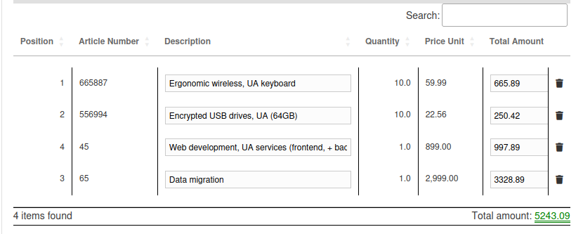
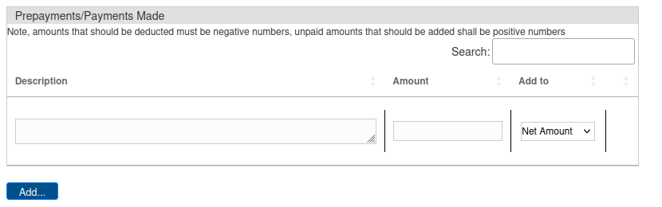
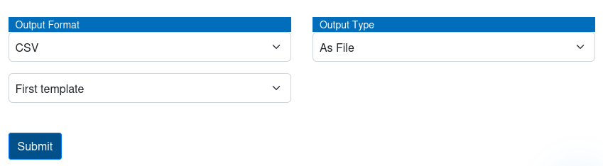

*Version: {{ page.meta.version }}*

  <a class="md-button print-button" href="../pdfs/Peppol-Documentation_with_Peppol.pdf" target="_blank">
    Get this section in PDF
  </a>

# Documentation with Peppol

In this section you will find a guide on how to have documentation being
Peppol compliant and you will also find a guide on how all validation
shall be visible once a your documentation is Peppol compliant.

## Creating Peppol-compliant Templates

Before you start having Peppol-compliant validations, you will need to
create templates that are also Peppol-compliant. This will allow our
system to automatically extract all the information from each element of
each document.

You will start by creating a new template as usual; a more in-depth
guide can be found on the [previous chapter](../System%20Overview/Template.md#adding-a-new-template)
about creating a new template.

Once you have created this new template and added all the fields as
usual, you shall trigger the system to be Peppol compliant. To do this,
you shall click on the respective check-box that is situated at the
bottom of the fields window, and all the Peppol-specific fields should
also pop-up.

{width="1000"}

Once you have triggered the system, you will now need to define all the
Peppol specific fields. The mechanism to define each field will be the
same as before, but in this part you will be defining all fields of each
element for itemization.
There are some important points that should be considered once linking
all fields:

-   All example values to which reference shall be referred shall refer
    to the first element of the document.

-   For the description specifically, you only need to click on the
    first element of the description.

Once you have linked all the different fields, you shall only click on
the `Submit` button located at the bottom of the page.

Now, all documents that use this template will automatically be Peppol
compliant.

## Peppol-compliant Validations

Once you start receive Peppol-compliant validations, you will start to
see the main advantage of using Peppol compliant data in our system.

#### Itemization of elements within each validation 

The first main difference that you will be able to see is the
itemization that will be available to be seen as a table in each
validation. This can be seen in the validation edit page, at the bottom
of the data page.

{width="600"}

#### Prepayments/Payments done table

The second additional element that is available when using Peppol enabled validations is allowing to store all (pre)payments made for a specific validation.

{width=850}

In order to add a new payment, it is as simple to add a new line into the table and save the values at the bottom of the validation's page.

!!! warning "Important"
    Please be aware that all the different payment values need to be inserted in relation to the document, which means that if a document has already been partially paid, the number inserted will be **negative**.

#### Payment Terms indication table

The third additional element is the `Payment terms` field. In this table you shall enter any specific payment terms that the respective customer has requested.

{width=750}

#### Exportation of all items 

In addition, you can also export all the different items into a file.
You will have the ability to choose the export format as well as the
template.

!!! info
    Please, make sure that you have a template that satisfies your
    satisfaction before exporting a validation.

To realise this operation, you will need to go to the edit page of the
validation that you would like to export and navigate to the end of the
data page.

Once there, you will be able to see all the selective fields where you
can select the format of export as well as the template that you would
like to use.
Once you have selected your preference, you will only need to click on
the `Export` button at the bottom of the page, and the file will
automatically download to your system.

{width="600"}
