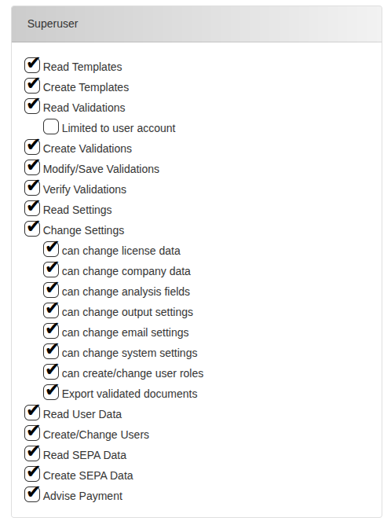

*Version: {{ page.meta.version }}*

  <a class="md-button print-button" href="./pdfs/System Overview and User Management.pdf" target="_blank">
    Télécharger cette section au format PDF
  </a>

# Introduction

Ce chapitre fournit une vue d’ensemble du système et décrit ses
principaux composants et fonctionnalités. Il explique comment les
responsabilités sont réparties entre différents rôles d’utilisateurs,
met en évidence les aspects essentiels de sécurité et d’accès, et décrit
les différentes vues disponibles dans l’interface utilisateur.
Comprendre ces notions fondamentales aidera les utilisateurs à naviguer
et interagir efficacement avec le système.

???+ info
    -   `Document :` dans notre système, lorsque nous parlons de documents,
        nous faisons référence aux **factures, notes de crédit, bons de
        livraison, bons de commande, confirmations de commande**, en
        d’autres termes, à tous les documents financiers généralement
        échangés dans les entreprises.

    -   `Validation :` entité de notre système représentant un document
        entrant ou sortant qui a été enregistré dans notre système.

    -   `Modèles :` Un modèle, dans notre système, regroupe toutes les
        entités utilisées comme référence pour extraire des données des
        futurs documents entrants/sortants.

    -   `"Données d’en-tête/pied de page" :` Tous les champs qui forment
        l’en-tête et le pied de page du document (informations générales du
        document).

    -   `"Postes de ligne" :` Éléments positionnés du document, en d’autres
        termes, toutes les données utilisées pour l’extraction de données
        Peppol.

## Objectif et fonctionnalités

Bienvenue dans le manuel utilisateur d’Extractional. Dans ce guide, vous
trouverez des informations complètes sur l’utilisation efficace de notre
logiciel. Avant de commencer, nous allons vous présenter brièvement son
objectif et expliquer comment il peut aider votre entreprise à optimiser
ses opérations et gagner un temps précieux.

### Extraction et automatisation des données des documents d’achat

L’objectif principal de notre système est d’extraire les données de tous
les documents d’achat et de facturation entrants et sortants d’une
entreprise. Une fois extraites, ces données sont traitées, ce qui permet
d’automatiser des processus et de les exporter automatiquement vers
d’autres systèmes, réduisant ainsi la charge de travail manuelle.

#### Extraction de fichiers PDF

Notre logiciel extrait les données de tous les fichiers au format PDF.
Cela permet à nos utilisateurs de conserver leurs habitudes de
facturation et de continuer à utiliser l’un des formats les plus
courants pour ce type de document.

{ width="300"}
/// caption

///

#### Connexion directe au compte e-mail

{width="50" align=left}

Le logiciel insère automatiquement tous les documents de facturation
entrants dans le système en se connectant directement à une adresse
e-mail. Cela se fait via une connexion IMAP, disponible pour la plupart
des domaines de messagerie.

### Utilisation des données numériques

Un des principaux avantages de notre système est l’utilisation complète
des données numériques. Cela facilite l’organisation de votre entreprise
et améliore certaines tâches quotidiennes de vos employés.

#### Simplification du contrôle des documents

L’un des objectifs principaux atteints par notre logiciel est de rendre
l’organisation des documents entrants et sortants simple, sans perte de
temps inutile pour vos employés.

Comme vous le savez, le volume de documents que la plupart des
entreprises reçoivent et gèrent peut être écrasant. Suivre l’état de
chaque document et des transactions associées peut être difficile.

Notre système simplifie l’organisation des documents tout en suivant
leur statut. Il permet l’assignation automatique des documents aux
membres de l’équipe et utilise des indicateurs visuels (drapeaux,
marqueurs) pour préciser leur état. De plus, il organise toutes les
transactions associées à chaque document.

{width="600"}
/// caption
*Exemple d’un fichier existant dans notre système avec deux drapeaux attribués*
///

#### Amélioration de la recherche de fichiers

{width="50" align=left}

Puisque notre système repose sur un stockage numérique et utilise des
algorithmes de recherche et de filtrage rapides, il améliore la
productivité de votre entreprise en évitant la recherche manuelle de
documents comme auparavant.

#### Réduction de l’utilisation du papier

{width="50" align=left}

L’automatisation du traitement des documents avec notre système réduit
considérablement l’utilisation du papier. Comme il n’est plus nécessaire
d’imprimer les documents pour les organiser, votre entreprise peut
fonctionner dans un environnement quasi sans papier.

## Gestion des utilisateurs

Une fonctionnalité clé de notre système est la possibilité de définir
différents rôles d’utilisateurs et d’automatiser la répartition du
travail.

### Rôles utilisateurs

Notre système propose plusieurs rôles prédéfinis et permet également d’en
créer de nouveaux. Chaque rôle possède des autorisations spécifiques qui
déterminent la vue et les capacités de l’utilisateur dans le système.

#### Permissions

Les permissions contrôlent principalement le type d’accès de chaque
membre de l’équipe à la base de données des documents, ainsi que ce
qu’il peut créer, modifier ou supprimer.

{width="500"}
/// caption
*Illustration montrant toutes les permissions disponibles dans notre système*
///

Chaque permission a été définie pour garantir que toutes les opérations
importantes du système puissent être contrôlées. Voici les permissions
disponibles :

-   `Lire les modèles :` accès à tous les modèles et possibilité de les
    consulter.

-   `Créer des modèles :` création de nouveaux modèles, suppression ou
    modification des existants.

-   `Lire les validations :` lecture de toutes les validations
    (documents) disponibles.

    -   `Limité au compte utilisateur :` option permettant de restreindre
        la visibilité aux validations assignées à l’utilisateur.

-   `Créer des validations :` création de nouvelles validations, mais
    celles-ci restent non vérifiées.

-   `Modifier/Enregistrer des validations :` modification des données
    extraites d’un document et enregistrement dans le système.

-   `Vérifier des validations :` validation et publication des documents.

-   `Lire les paramètres :` consultation des préférences système sans
    possibilité de modification.

-   `Modifier les paramètres :` modification de certains ou de tous les
    paramètres, selon les droits attribués.

-   `Lire les données utilisateurs :` accès aux données des utilisateurs
    système.

-   `Créer/Modifier des utilisateurs :` création ou modification de
    comptes.

-   `Lire les données SEPA :` accès aux données liées aux paiements
    (ex. coordonnées bancaires).

-   `Créer des données SEPA :` création de données SEPA pour
    automatiser les paiements.

-   `Marquer un paiement :` possibilité de signaler un document comme
    « payé ».

#### Pourquoi utiliser des rôles utilisateurs

L’avantage des rôles prédéfinis est de simplifier la gestion : il suffit
d’adapter les permissions d’un rôle plutôt que de modifier individuellement
chaque utilisateur.

### Gestion simplifiée des collaborateurs

Notre logiciel permet de suivre la charge de travail de votre équipe,
garantissant une répartition équilibrée. Cela aide à identifier et
corriger les déséquilibres afin d’assurer un travail collaboratif et
efficace.

## Intégration fluide entre les services Achats et Comptabilité

{width="50" align=left}

Extractional crée une connexion transparente entre les services Achats
et Comptabilité. Les données extraites et analysées par le service Achats
permettent au service Comptabilité d’avoir une compréhension claire de
chaque transaction.

### Exportation des données

Notre système permet d’exporter toutes les données dans différents
formats :

-   **`XML :`** export vers des logiciels de comptabilité comme **Sage
    BOB50**.  
-   **`JSON :`** format d’échange de données entre systèmes Extractional.  
-   **`CSV :`** export vers des tableurs comme Excel.  
-   **`Peppol :`** format international d’échange de documents
    électroniques.  
-   **`SEPA :`** format XML pour automatiser les paiements SEPA.  

## Sécurité et contrôle d’accès

La sécurité des documents et la gestion des accès sont au cœur de notre
système.

### Sécurité dans la base de données

Tous vos documents restent strictement confinés dans votre serveur
interne. Aucune donnée ne quitte votre réseau sauf si vous le décidez.

### Contrôle des accès

Deux mesures principales :  

- **Contrôle d’accès basé sur les rôles** (expliqué précédemment).  
- **Suivi des connexions :** chaque tentative de connexion est enregistrée
avec l’adresse IP et le statut (réussi ou échoué).  

{width="1000"}
